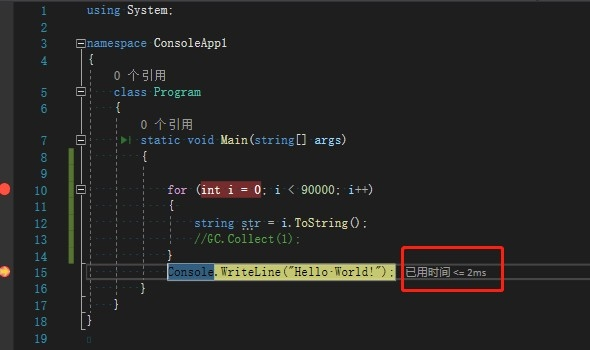
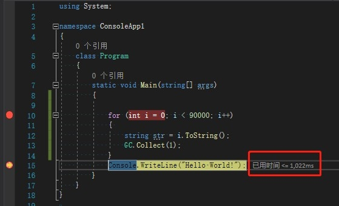

## 什么是垃圾回收

在编写程序时，会产生很多的数据 比如:int string 变量，这些数据都存储在内存里，如果不合理的管理他们，就会内存溢出导致程序崩溃

C#内置了自动垃圾回收GC，在编写代码时可以不需要担心内存溢出的问题 变量失去引用后 GC会帮我们自动回收，但不包括数据流，和一些数据库的连接，这就需要我们手动的释放资源

总结：让内存利用率更高

## 什么样子的对象才会给回收？

**GC只会回收 堆 的内存** ，而 值类型在 栈 中的使用完后马上就会给释放，并不需要 GC 进行处理，堆中的没有被引用或者null的对象才会被回收，静态的变量也不会被回收

上面说到他并不会回收一些数据流

比如: Stream StreamReader StreamWrite HttpWebResponse 网络端口 等还有一些数据库的连接这些对象需要调用 Close() 或者 Dispose() 方法进行 手动回收

总结：没有被引用的对象 或为 null的

## 什么时候进行垃圾回收？

什么时候回收这些都由操作系统决定，一般不需要进行理会全由系统调用，如有特殊情况，明确的需要进行释放 也可以强制的垃圾回收

GC.Collect()正常情况下 非常不建议使用这方法，这会让程序**暂停**但时间很短，会影响执行效率

需要注意的是 给释放后的内存是无法在找回的

总结：由操作系统决定 但也可以强制释放 正常情况不需要理会内存问题

效率问题（重要）

除非马上需要进行非常消耗内存的操作 其他情况尽量不要调用GC.Collect();

测试：

 for (int i = 0; i < 90000; i++)

{

  string str = i.ToString();

}

//假装我是一个方法哈

测试时间：2毫秒

假如每次使用完方法后强制垃圾回收

for (int i = 0; i < 90000; i++)

{

​    string str = i.ToString();

​    //假装我是一个方法哈

​    GC.Collect(1);

}

测试时间：1022毫秒

性能相差500倍

## **析构函数**注意点

该函数是在类使用完成后调用的，一些非托管资源 Sream 可以在此处调用Dispose()方法进行释放内存，一个类只有一个析构函数而且无法继承他

~Class1()

​        {

​            Console.WriteLine("我给调用了");

​        }

但有时候该函数并不会调用，无法控制何时调用析构函数，因为这是由垃圾回收器决定的，在垃圾回收时先运行析构函数再回收其他对象。

using System;

namespace ConsoleApp1

{

​    class Program

​    {

​        static void Main(string[] args)

​        {

​            Class1 c = new Class1();

​            c.A();

​            Console.WriteLine("End");

​        }

​    }

​    class Class1

​    {

​        public void A()

​        {

​            Console.WriteLine("xxxx");

​        }

​        ~Class1()

​        {

​            Console.WriteLine("我给调用了");

​        }

​    }

}

结果：

可以看到 析构函数 并没有给使用，假如你写的是一些释放资源的方法，那也不会执行该函数。