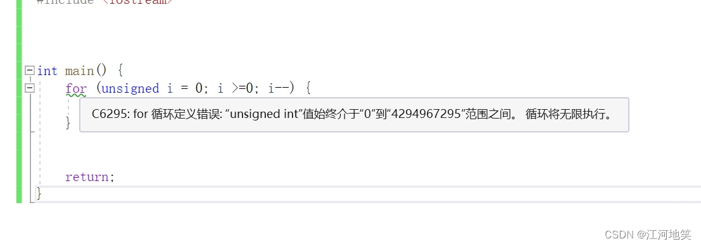
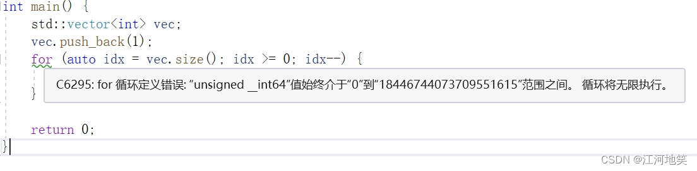

1、**unsigned不够理解**

代码死循环

**2、容器的size()返回的也是无符号整型**

代码死循环

**3、 容器删除元素迭代器失效**

当从 std::vector 中移除一个元素时，所有该位置之后的元素都会向前移动，这意味着迭代器、引用和指向被移动元素的指针都会失效。

for (auto iter = vec.begin(); iter != vec.end(); ++iter) {  // error

​        if (*iter == a) {

​            vec.erase(iter); // 错误

​        }

​    }

 **4、注释尽量用//而不是/\**/**

关于中文乱码问题

**5、成员变量没有初始化行为需要手动初始化**

这样做的原因是为了确保数据的一致性和预期行为，避免出现未初始化的变量导致的不确定性和潜在的错误。

class MyClass {

public:

​    MyClass() : myInt(0), myDouble(0.0) {} // 构造函数中初始化

 

private:

​    int myInt;    // 这些成员变量不会自动初始化

​    double myDouble;

};

6.浮点数判断

浮点数判断是否相等是一个常见的问题，由于浮点数在计算机中以二进制形式存储，并且存在精度限制，因此直接用等号判断两个浮点数是否相等是不可靠的。（单精度浮点数（float）使用32位来表示，双精度浮点数（double）使用64位来表示。这样的位数是有限的，无法表示所有的实数，因此存在精度限制）

\#include <iostream>

\#include <cmath> // 包含 abs 函数的头文件

using namespace std;

int main() {

​    float f = 0.2;

​    // 错误用法：直接用等号判断浮点数是否相等

​    if (f == 0.2) {

​        cout << "1true"; // 不会输出，因为等号判断在浮点数上不可靠

​    }

​    // 正确用法：通过比较浮点数的差值是否小于一个很小的阈值

​    if (abs(f - 0.2) < 0.00001) {

​        cout << "2true"; // 输出，差值小于阈值，判断为相等

​    }

​    return 0;

}

在实际应用中，常用的方法是判断两个浮点数的差值是否在某个很小的范围内，例如上面代码中的 0.00001。这个阈值可以根据具体的需求和精度要求进行调整。需要注意的是，浮点数比较精度的选择需要兼顾到精度和性能的平衡。通常情况下，选择一个适当的较小值作为阈值可以满足大多数需求。

 7、对象切割

当一个派生类对象被赋值给一个基类对象时，超出基类部分的成员变量会被“切割”掉，这会导致信息丢失。这个问题通常发生在使用值传递而非引用或指针传递派生类对象时。为了避免对象切割，应当使用指针或引用来处理多态。

 错误案例

\#include <iostream>

using namespace std;

 

class Base {

public:

​    Base() { cout << "Base constructor\n"; }

​    virtual void print() { cout << "Base class\n"; }

​    virtual ~Base() { cout << "Base destructor\n"; }

};

 

class Derived : public Base {

public:

​    Derived() { cout << "Derived constructor\n"; }

​    void print() override { cout << "Derived class\n"; }

​    ~Derived() override { cout << "Derived destructor\n"; }

 

​    void specificFunction() { cout << "Specific function for Derived\n"; }

};

 

 

void functionByValue(Base b) {

​    cout << "************关注下面这一句****************" << endl;

​    b.print(); // 这里会调用 Base 的 print，而不是 Derived 的

​    cout << "****************************" << endl;

}

 

int main() {

​    Derived d;

​    functionByValue(d); // 将 Derived 对象以值传递给函数

​    return 0;

}

在 main 函数中，我们创建了一个 Derived 类的对象 d。当我们调用 functionByValue 并将 d 传递进去时，由于函数接受的是 Base 类型的值，因此 d 对象会被切割为 Base 类型。这意味着，函数内部的 b 对象只包含 Base 类的部分，Derived 类特有的成员和行为（如 specificFunction 方法和 Derived 类的 print 方法实现）都被丢弃了。因此，即使我们传递了一个 Derived 类型的对象，函数内部调用的 print 方法仍然是 Base 类的版本。 

正确案例：

修改为引用类型

void functionByReference(Base& b) {

​    b.print(); // 这会调用正确的 print 方法，即 Derived 的 print

}

 

int main() {

​    Derived d;

​    functionByReference(d); // 通过引用传递

​    return 0;

}

 在这个修正后的版本中，我们通过引用传递 Derived 对象，因此 functionByReference 函数内部可以正确地调用 Derived 类的 print 方法，而不会发生对象切割。