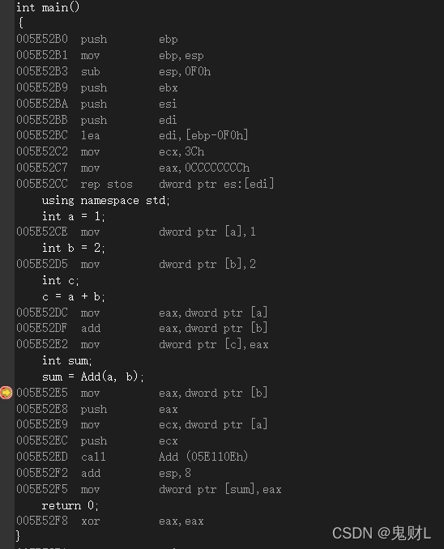
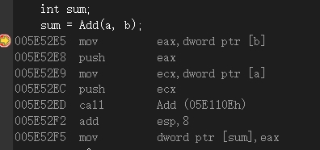
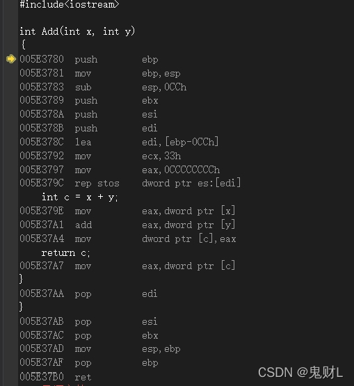

## 函数压栈与退栈

函数的压栈和退栈过程是与函数调用和返回相关的。在程序执行过程中，当一个**函数被调用**时，会发生**函数压栈（入栈）**的过程；当**函数执行完成并返回**时，会发生**函数退栈（出栈）**的过程。这**与栈数据结构的后进先出特性密切相关**。

### 函数压栈（函数调用的过程）

保存当前函数的状态：在调用一个新函数之前，当前函数的执行状态（包括局部变量、函数参数、返回地址等）需要保存。这些信息通常被保存在栈帧中

分配新的栈帧：栈帧是一个数据块，用于存储被调用函数的执行状态信息，每个栈帧都对应着一个未运行完的函数

将参数传递给被调用函数：将调用函数传递给被调用函数的参数压入新的栈帧中。

**更新栈指针**：栈指针会指向当前栈帧的顶部，当一个新的栈帧被创建时，栈指针会相应地更新

### 函数退栈

获取返回值： 当函数执行完成时，它可能会返回一个值。这个返回值通常存储在寄存器（快速访问）中，或者通过栈传递给调用函数。

恢复调用函数的状态： 从当前函数的栈帧中恢复调用函数的状态，包括局部变量、参数和返回地址等。

释放当前函数的栈帧： 当函数执行完成后，其栈帧被弹出，释放相应的栈空间。这导致栈指针向下移动，指向调用函数的栈帧。

跳转到返回地址： 使用返回地址将控制权返回到调用函数。返回地址是在函数调用时被保存在栈帧中的。

### 案例

我们写的程序在运行之前，得进行编译，编译过程的最终产品是可执行程序–**由一组机器语言指令组成**。运行程序时，操作系统将这些指令载入到计算机内存中，因此每条指令都有特定的内存地址。比如看以下的代码：

源代码

\#include<iostream>

int Add(int x, int y)

{

​	int c = x + y;

​	return c;

}

int main()

{

​	using namespace std;

​	int a = 1;

​	int b = 2;

​	int c;

​	c = a + b;

​	int sum;

​	sum = Add(a, b);

​	return 0;

}

调试转汇编

过程详述：

这个过程可以总结为以下步骤：

\1. 初始化堆栈帧：开始时保存调用前的堆栈帧信息，建立新的堆栈帧用于函数调用过程中的局部变量和参数存储。

\2. 分配局部变量空间：在堆栈上分配空间用于存储局部变量和临时数据。

\3. 保存寄存器状态： 保存调用前的寄存器状态，保留调用者的寄存器值。

\4. 清空局部变量空间：使用`rep stos`指令清空局部变量空间，初始化局部变量为特定值。

\5. 计算表达式结果： 将函数参数加载到寄存器中，进行运算并存储结果到局部变量。

\6. 恢复寄存器状态：恢复调用前的寄存器状态，包括ebx、esi、edi等寄存器。

\7. 释放局部变量空间：恢复堆栈指针，释放局部变量空间。

\8. 恢复堆栈帧：恢复调用前的堆栈帧信息，返回到调用者。

这个过程包括了函数调用的准备工作、计算和存储函数结果、以及清理和恢复工作，确保函数执行过程中堆栈和寄存器状态的正确性和一致性。

我们可以看到，在最左则即 指令的相关内存地址 。

需要注意的是，程序在调试时，其程序是在运行的，即 运行才可调试。

计算机随后逐步执行这些指令。有时（如有循坏或分支语句时），将跳过一些指令，向前或向后跳到特定地址。

执行到函数调用指令时，程序将在函数调用后立即存储该指令的内存地址，并将函数参数复制到堆栈（为此保留的内存块），跳到标记函数起点的内存单元，执行函数代码（也许还需将返回值放入到寄存器中），然后跳回到地址被保存的指令处（这与阅读文章时停下来看脚注，并在阅读完脚注后返回到以前阅读的地方类似）。来回跳跃并记录位置意味着以前使用函数时，需要一定的开销。

上诉图片中如此

call表示调用此函数，即找到Add()此函数的代码存储地（函数被编译后运行，其指令储存在内存的 **代码段** 里，而现在是在main函数开辟的栈帧中，所以能看到函数地址与它们相差甚远），前面的push，即复制函数参数到堆栈。做好调用准备后，开辟函数栈帧，执行指令。如下图：

也可以看到Add()函数中的内存地址与图一即main()函数的内存地址不同，且有一定的差距，因为是跳出main()函数的栈帧，去创建Add()函数的栈帧，但也不会差太多，实际上Add()栈帧是压在main()栈帧上的，可以看到它们的内存地址前四位都是 005E ，而Add函数的地址在代码段中，与其相差甚远。

为此正常调用，得保存main()栈帧中执行指令的地址，以便执行完函数后可以返回继续执行接下来的指令。