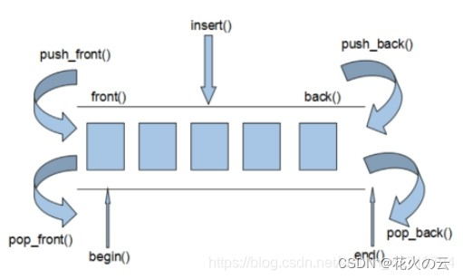
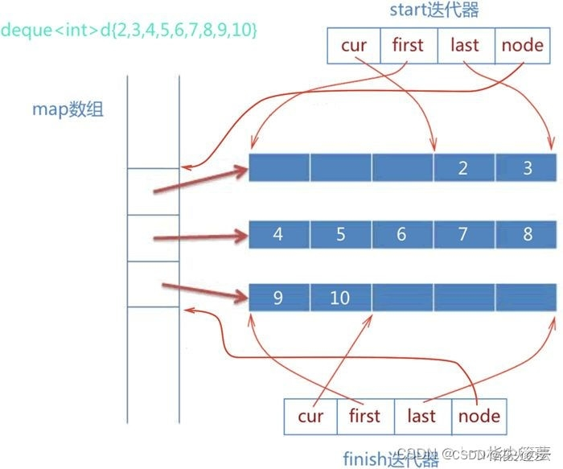

## 存储

和 vector 容器采用连续的线性空间不同，deque 容器存储数据的空间是由**一段一段**等长的连续空间构成，各段空间之间并不一定是连续的，可以位于在内存的不同区域。为了管理这些连续空间，deque 容器用数组（数组名假设为 map）存储着各个连续空间的首地址。也就是说，map 数组中存储的都是指针，指向那些真正用来存储数据的各个连续空间。如下所示：

通过建立 map 数组，deque 容器申请的这些分段的连续空间就能实现“整体连续”的效果。换言之，当 deque 容器需要在头部或尾部增加存储空间时，它会申请一段新的连续空间，同时在 map 数组的开头或结尾添加指向该空间的指针，由此该空间就串接到了 deque 容器的头部或尾部。可能你会问，如果 map 数组满了怎么办？很简单，再申请一块更大的连续空间供 map 数组使用，将原有数据（很多指针）拷贝到新的 map 数组中，然后释放旧的空间。deque 容器的分段存储结构，提高了在序列两端添加或删除元素的效率，但也使该容器迭代器的底层实现变得更复杂。

## 底层实现

deque 容器除了维护先前讲过的 map 数组，还需要维护 start、finish 这 2 个 deque 迭代器。如下所示，为 deque 容器的定义：// _Alloc为内存分配器template<class _Ty,    class _Alloc = allocator<_Ty>>class deque{    ...protected:    iterator start;    iterator finish;    map_pointer map;...}其中，start 迭代器记录着 map 数组中首个连续空间的信息，finish 迭代器记录着 map 数组中最后一个连续空间的信息。另外需要注意的是，和普通 deque 迭代器不同，start 迭代器中的 cur 指针指向的是连续空间中首个元素；而 finish 迭代器中的 cur 指针指向的是连续空间最后一个元素的下一个位置。因此，deque 容器的底层实现如下所示：

借助 start 和 finish，以及 deque 迭代器中重载的诸多运算符，就可以实现 deque 容器提供的大部分成员函数

## deque是怎么实现扩容的

  deque是由一段一段的定量的连续空间构成。一旦有必要在deque前端或者尾端增加新的空间，便配置一段连续定量的空间，串接在deque的头端或者尾端。

deque的API和vector的API大多数无异，但是增加了头删和头添deque大小操作:

deque.size();//返回容器中元素的个数deque.empty();//判断容器是否为空deque.resize(num);//重新指定容器的长度为num,若容器变长，则以默认值填充新位置。如果容器变短，则末尾超出容器长度的元素被删除。deque.resize(num, elem); //重新指定容器的长度为num,若容器变长，则以elem值填充新位置,如果容器变短，则末尾超出容器长度的元素被删除。

deque双端插入和删除操作:

push_back(elem);//在容器尾部添加一个数据

push_front(elem);//在容器头部插入一个数据

pop_back();//删除容器最后一个数据

pop_front();//删除容器第一个数据

## **vector与deque的比较**

vector重分配在性能上是有开销的，如果在使用之前元素的数量已知，那么可以使用reserve()函数来消除重分配。

deque的存储按需自动扩展及收缩，扩展deque比扩张vector更优，因为它不涉及到复制既存元素到新内存位置。但另外一方面，deque典型地拥有较大的最小内存开销，所以当即使保有一个元素的时候，deque也需要为它分配它的整个内部数组。