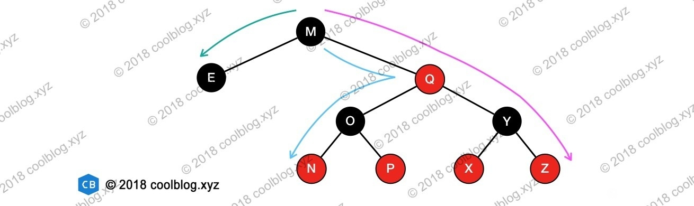

## map、set底层--红黑树

红黑树是一种自平衡的二叉查找树，是一种高效的查找树。红黑树具有良好的效率，它可在 O(logN) 时间内完成查找、增加、删除等操作

红黑树通过如下的性质定义实现自平衡：

节点是红色或黑色。

根节点是黑色。

所有叶子都是黑色（叶子是NIL节点）。

每个红色节点必须有两个黑色的子节点。（从每个叶子到根的所有路径上不能有两个连续的红色节点。）

从任一节点到其每个叶子的所有简单路径都包含相同数目的黑色节点（简称黑高）。

有了上面的几个性质作为限制，即可避免二叉查找树退化成单链表的情况。但是，仅仅避免这种情况还不够，这里还要考虑某个节点到其每个叶子节点路径长度的问题。如果某些路径长度过长，那么，在对这些路径上的节点进行增删查操作时，效率也会大大降低。这个时候性质4和性质5用途就凸显了，有了这两个性质作为约束，即可保证任意节点到其每个叶子节点路径最长不会超过最短路径的2倍。原因如下：

当某条路径最短时，这条路径必然都是由黑色节点构成。当某条路径长度最长时，这条路径必然是由红色和黑色节点相间构成（性质4限定了不能出现两个连续的红色节点）。而性质5又限定了从任一节点到其每个叶子节点的所有路径必须包含相同数量的黑色节点（去除掉所有的红色节点后，深度处处相同）。此时，在路径最长的情况下，路径上红色节点数量 = 黑色节点数量。该路径长度为两倍黑色节点数量，也就是最短路径长度的2倍。举例说明一下，请看下图（没有放上NIL节点）：

上图画出了从根节点 M 出发的到其叶子节点的最长和最短路径。可以看见最长路径的长度正好为最短路径长度的2倍。（红黑树的节点树N满足2^(h/2) <= N <= 2^h，推得1/2h<=log2(N) <= h ，则红黑树高度为logN）

## 红黑树与avl的区别

1、调整平衡的实现机制不同：

红黑树根据节点颜色(同一双亲节点出发到哨兵节点，所有路径上的黑色节点数目一样)，一些约定和旋转实现；

AVL根据树的平衡因子(所有节点的左右子树高度差的绝对值不超过1)和旋转决定

2、红黑树的插入效率更高！！！

红黑树是用非严格的平衡来换取增删节点时候旋转次数的降低，任何不平衡都会在三次旋转之内解决，红黑树并不追求“完全平衡”，它只要求部分地达到平衡要求，降低了对旋转的要求，从而提高了性能

而AVL是严格平衡树(高度平衡的二叉搜索树)，因此在增加或者删除节点的时候，根据不同情况，旋转的次数比红黑树要多。所以红黑树的插入效率更高

3、红黑树统计性能比AVL树更高

 红黑树能够以O(log n)  的时间复杂度进行搜索、插入、删除操作。

 红黑树的算法时间复杂度和AVL相同，但统计性能比AVL树更高，典型的用途是实现关联数组。

  AVL树查找、插入和删除在平均和最坏情况下都是O(log n)。

4、适用性：AVL查找效率高

如果你的应用中，搜索的次数远远大于插入和删除，那么选择AVL树，

如果搜索，插入删除次数几乎差不多，应选择红黑树。即，有时仅为了排序（建立-遍历-删除），不查找或查找次数很少，R-B树合算一些。

5、AVL树定义：

1>它的左子树和右子树都是AVL树 2>左子树和右子树的高度差不能超过1 

红黑树定义：

1> 每个结点或者为黑色或者为红色。 2>根结点为黑色。 3>每个叶结点(实际上就是NULL指针)都是黑色的。 4>如果一个结点是红色的，那么它的两个子节点都是黑色的（也就是说，不能有两个相邻的红色结点）。 5>对于每个结点，从该结点到其所有子孙叶结点的路径中所包含的黑色结点数量必须相同。 即(同一双亲节点出发到哨兵节点，所有路径上的黑色节点数目一样)

map应用场景

字典、计数器、有序存储、数据索引