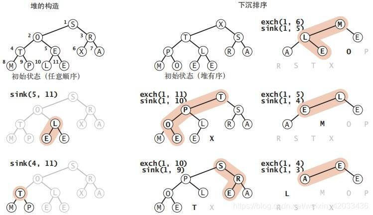
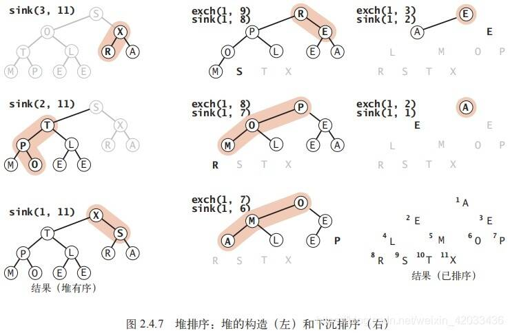

优先级队列为，首部元素最大，总是删除当前最大元素。并在尾部插入元素

实现原理

堆排序

堆排序： 我们可以把任意优先队列变成一个排序算法：如将使用一个查找最大（最小）元素的优先队列并重复删除最大（最小）元素。

实际上用无序数组实现的查找最小元素的优先队列这么做相当于进行一次选择排序。

堆排序可以分为两个阶段

1. 堆的构造阶段

我们将原始数组重新组织安排进一个堆中；

   2.下沉排序阶段

我们从堆中按递减顺序取出所有元素并得到排序结果。

1. 堆的构造

构造堆从左至右遍历数组，用 swim() 保证扫描指针左侧的所有元素已经是一棵堆有序的完全树即可，就像连续向优先队列中插入元素一样。

更高效的方法是使用sink()下沉方法： 如果一个结点的两个子结点都已经是堆了，那么在该结点上调用 sink() 可以将它们变成一个堆。

2. 下沉排序

堆排序的主要工作都是在第二阶段完成的。这里我们将堆中的最大元素删除，然后放入堆缩小后数组中空出的位置。

快速排序（Quick Sort）相比堆排序（Heap Sort）在某些情况下更快，主要原因包括以下几点：

1. 局部性原理：

   \- 快速排序对数据的访问具有良好的局部性原理。它通过选取一个基准值，将数据分为左右两部分，然后分别对左右部分进行递归排序。

   \- 在排序过程中，数据访问是连续的，而且对左右部分的排序可以分别进行，减少了随机访问的开销，利用了CPU缓存的局部性，提高了访问效率。

2. 平均时间复杂度：

   \- 在平均情况下，快速排序的时间复杂度为O(nlogn)，而堆排序的时间复杂度也为O(nlogn)。

   \- 虽然两者的时间复杂度相同，但由于快速排序的常数因子较小，并且对局部性有利，因此在实际应用中可能会表现更快。

3. 最坏情况：

   \- 在最坏情况下，快速排序的时间复杂度为O(n^2)，主要出现在基准值选择不当的情况下（如已序或逆序情况）。

   \- 堆排序的时间复杂度稳定，在任何情况下都是O(nlogn)。

综合来看，快速排序在平均情况下表现更优，尤其是对于大规模数据的排序，而堆排序对稳定性要求较高，或者需要保证最坏情况下的性能时更适合使用。选择排序算法需要根据具体场景和需求来决定。