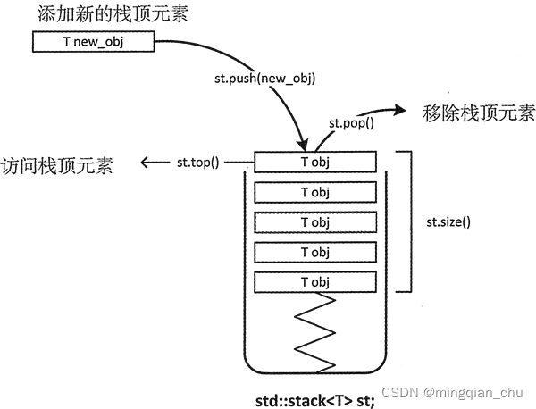

stack 栈适配器是一种**单端开口**的容器（如图 1 所示），实际上该容器模拟的就是栈存储结构，即无论是向里存数据还是从中取数据，都只能从这一个开口实现操作。

如图 1 所示，stack 适配器的开头端通常称为栈顶。由于数据的存和取只能从栈顶处进行操作，因此对于存取数据，stack 适配器有这样的特性，即每次只能访问适配器中位于最顶端的元素，也只有移除 stack 顶部的元素之后，才能访问位于栈中的元素。

栈中存储的元素满足“后进先出（简称LIFO）”的准则，stack 适配器也同样遵循这一准则。