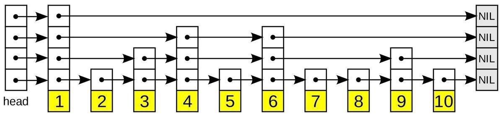
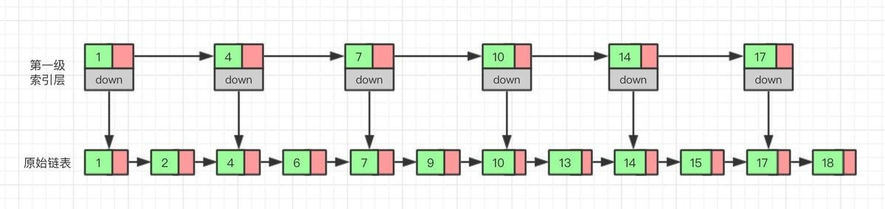

什么是跳表

跳表全称为跳跃列表，它允许快速查询，插入和删除一个有序连续元素的数据链表。跳跃列表的平均查找和插入时间复杂度都是O(logn)。快速查询是通过维护一个多层次的链表，且每一层链表中的元素是前一层链表元素的子集（见右边的示意图）。一开始时，算法在最稀疏的层次进行搜索，直至需要查找的元素在该层两个相邻的元素中间。这时，算法将跳转到下一个层次，重复刚才的搜索，直到找到需要查找的元素为止。

一张跳跃列表的示意图。每个带有箭头的框表示一个指针, 而每行是一个稀疏子序列的链表；底部的编号框（黄色）表示有序的数据序列。查找从顶部最稀疏的子序列向下进行, 直至需要查找的元素在该层两个相邻的元素中间。

跳表的演化过程

对于单链表来说，即使数据是已经排好序的，想要查询其中的一个数据，只能从头开始遍历链表，这样效率很低，时间复杂度很高，是 O(n)。 那我们有没有什么办法来提高查询的效率呢？我们可以为链表建立一个“索引”，这样查找起来就会更快，如下图所示，我们在原始链表的基础上，每两个结点提取一个结点建立索1引，我们把抽取出来的结点叫作索引层或者索引，down 表示指向原始链表节点的。指针。

现在如果我们想查找一个数据，比如说 15，我们首先在索引层遍历，当我们遍历到索引层中值为 14 的结点时，我们发现下一个结点的值为 17，所以我们要找的 15 肯定在这两个结点之间。这时我们就通过 14 结点的 down 指针，回到原始链表，然后继续遍历，这个时候我们只需要再遍历两个结点，就能找到我们想要的数据。好我们从头看一下，整个过程我们一共遍历了 7 个结点就找到我们想要的值，如果没有建立索引层，而是用原始链表的话，我们需要遍历 10 个节点。

通过这个例子我们可以看出来，通过建立一个索引层，我们查找一个基点需要遍历的次数变少了，也就是查询的效率提高了。