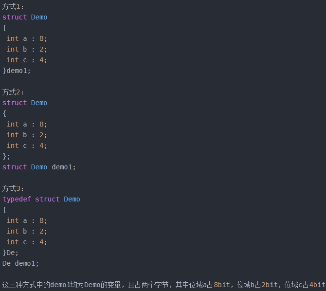

有些信息在存储时，并不需要占用一个完整的字节，而只需要占一个或几个二进制位。例如在存放一个开关量时，只有0和1两种状态，只需要用一位二进制位即可。为了节省存储空间，并且为了让处理变得更便捷，C语言又提供了一种数据结构，称为“位域”或者“位段”。所谓位域，就是把**一个字节中的二进制位划分为不同的区域**，并说明每个区域的位数。每个域都有一个域名，允许程序中按照域名进行操作。**这样就可以把几个不同的对象用一个字节的二进制位域来表示**。

