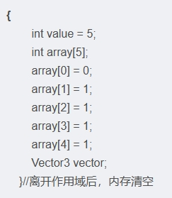
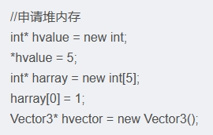

堆栈定义简述

在应用程序启动后，操作系统会将整个程序**加载到内存**，并分配一大堆**ram**[物理内存,也称为随机存取存储器,用于临时存储 CPU 当前正在处理的数据和程序指令]，栈和堆是ram中实际存在的两个区域，同时**活跃于内存**中，区别在于**内存分配的方式**

堆和栈是计算机内存中存储数据的两种方式，它们在数据类型和使用方式上有一些不同之处。

栈

栈是一个预定义大小的内存区域，通常为2兆字节，存储的时候**栈指针不断向后移动**，可以看见存储的数据在一定程度上（Debug模式会存在数据之间的保护数据）是**连续**的，所以**分配内存会比较快** ，在程序运行到**离开**函数（**变量的作用域**）之后，**栈中对应的内存就会清空**

栈存储在程序运行时的栈内存区域中，用于存储局部变量、函数参数、函数返回地址等。

栈存储的数据类型通常是基本数据类型（如整型、浮点型、字符型等）和指针类型。

栈用于存储局部数据和基本数据类型，由编译器自动管理内存

堆

堆也是一个预定义了默认值的区域,主要使用**new(开始申请堆内存)**，这实际上**调用了malloc函数**，它会去浏览程**序运行就创建好的空闲列表**，找到**空闲的区域**，动态**分配**对应的指针（内存地址），所以会**慢一些**

堆存储在程序运行时的堆内存区域中，用于存储动态分配的对象和数据结构。

堆存储的数据类型可以是任意复杂的数据结构，包括对象、数组、链表等。

堆用于存储动态分配的对象和复杂数据结构，需要手动管理内存

cpu cache miss

由于堆和栈内存分配的方式有可能会出现**缓存不命中**的情况，也就是cpu cache miss（局部变量被存储在栈上，而**该函数的执行需要频繁访问这些变量，但这些变量不在缓存中**）但是一般**miss的数量不足**以造成影响。