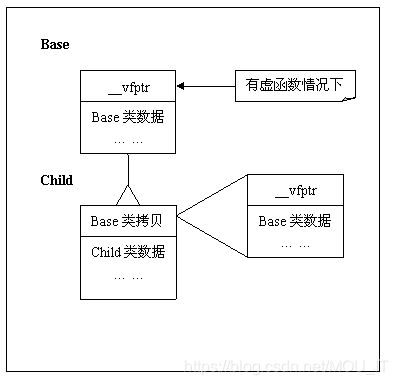

 **类对象内存结构** 

​    在C++中，如果类中有虚函数，那么它就会有一个虚函数表的指针**__vfptr**，在类对象最开始 有 的内存数据中。之后是类中的成员变量的内存数据。 对于子类，最开始的内存数据记录着父类对象的拷贝（包括父类虚函数表指针和成员变量）。 之后是子类自己的成员变量数据。 对于子类的子类，也是同样的原理。（但是无论继承了多少个子类，对象中始终只有一个虚函数表指针。 ？不确定）

