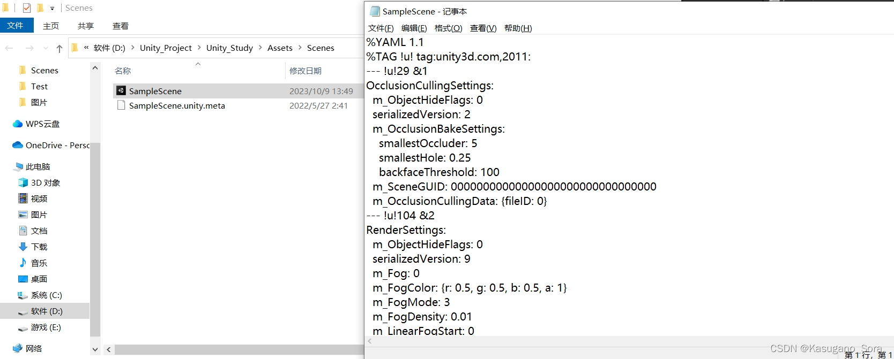
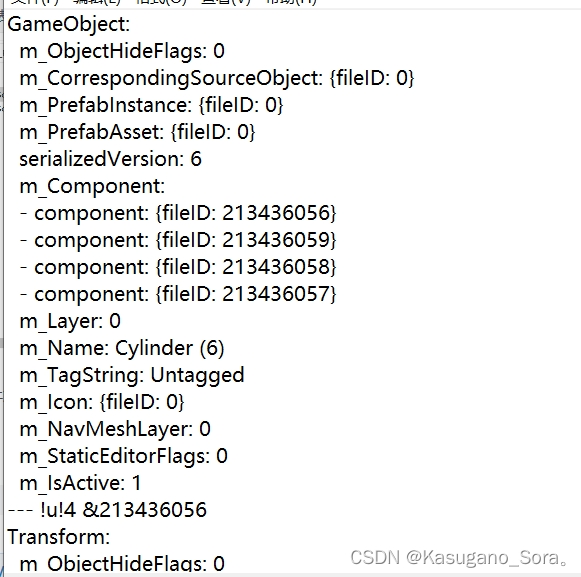
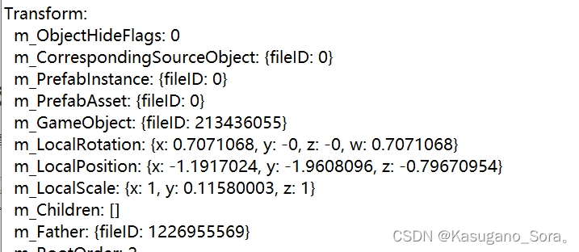
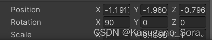

一：什么是反射

C#编写的程序会编译成一个程序集(.DLL或.exe)，其中会包含元数据、编译代码和资源，通过反射可以获取到程序集中的信息

通俗来讲，反射就是我们在只知道一个对象的外部而不了解内部结构的情况下，可以知道这个对象的内部实现

二：反射的优缺点

首先在编译中分为动态编译和静态编译，静态编译是在编译中确定类型，绑定对象，而动态编译是在运行中确定类型，绑定对象

反射的优点就是可以动态创建对象、绑定对象，提高了程序的灵活性和扩展性，但反射是一种解释操作，在性能上不如静态编译快

三：通过Type类获取程序集、模块、类的相关信息

——Type类是一个抽象类，因此不能用他去实例化对象

——object类中定义了一个GetType方法，因此所有类都可以使用GetType()获取到某一个对象所属类的Type对象（有命名空间的话参数填命名空间.类名）

——通过Type对象可以获取到类中字段、属性、方法、构造函数等信息

（——获取的时候可以通过BindingFlags筛选，注意BindingFlags.Static和BindingFlags.Instance这两个必须要使用一个，BindingFlags.NonPublic和BindingFlags.Public这两个必须要使用一个，默认是BindingFlags.Static|BindingFlags.Public|BindingFlags.Instance）

代码示例：

​        //1.通过对象获取到这个对象所属类的Type对象

​        TestClass c = new TestClass();

​        Type t = c.GetType();

 

​        //2.通过Type类中的静态方法GetType获取到类的Type对象

​        //Type t = Type.GetType("TestClass");

 

​        //3.通过typeof关键字获取到类的Type对象

​        //Type t = typeof(TestClass);

 

​        Console.WriteLine(t.Name);//获取类名(不带命名空间)

​        Console.WriteLine(t.FullName);//获取类名(带命名空间)

​        Console.WriteLine(t.Assembly);//获取程序集

​        Console.WriteLine(t.BaseType);//获取基类类型

Unity中工作原理

Unity开发的本质就是在Unity引擎的基础上，利用反射和引擎提供的各种功能进行拓展开发。

这里最重要的知识点就是C#中的反射，这里就提一下反射的概念

反射：程序在运行过程中，可以查看自身或者其他程序集的元数据，一个运行程序查看本身或者其他程序集的元数据的行为，就叫做反射。

在程序运行中，通过反射可以得到其他程序集或者自己程序集的代码的各种信息，比如类，函数，变量，对象等等，我们可以实例化它们，执行他们和操作他们。   

Unity中的反射机制是如何体现的呢？

首先我们都知道，场景中所有的对象，都是 依附于Unity提供给我们的作为场景中所有对象的根本——GameObject类对象

如果我们需要该物体按照我们的想法来行动，我们通常会给该物体添加脚本或者时其他组件，这个过程就是利用反射new了一个新对象，将该对象和GameObject对象进行关联

这么说可能会有点难懂，实际上就是，所有对象都是GameObject，但为什么GameObject会有不同的表现形式例如相机，就是因为往该GameObject对象添加了Camera这个组件，这个过程就是，利用反射将Unity给我们的程序集中的Camera对象new了一个出来，并将两个对象联系起来，让GameObject对象具有了相机的特性，Unity帮我们把这一步完成了。

用图示来表现：我们在场景中创建一个3d对象Cube，它之所以能是一个立方体，是因为在GameObject对象的基础上，依附了通过反射创建的Transform、Cube、MeshRenderer、BoxCollider等对象，这些对象共同形容了出一个立方体

例子：

1.修改Inspector面板中Transform的内容的过程

利用反射，已知对象名，类名，变量名，通过反射，来修改该对象中变量的值

2.脚本中公共成员为什么能出现在Inspector面板中

利用反射，已知类名，可以获取所有公共成员，因此能在Inspector面板中看到脚本中所有的公共成员

**游戏场景的本质**

我们用记事本打开Assets目录下的场景文件

会发现，**场景文件本质上就是配置文件**，我们能在文件中找到我们场景中所有的对象信息，如：

我们拿Cube里的Transform组件来举例，慢慢体会场景的本质

**已知类名Transform，就可以利用反射new一个类对象，并给该对象的成员变量进行赋值，赋完之后值，就可以利用Unity内部的机制，在场景中表现出来**

**我们修改Inspector面板中值的过程就是利用反射修改Transform类对象的成员变量值，再利用内部机制，重新在场景中表现出来。**

场景的保存，本质上就是存储为一个配置文件，通过反射将配置文件中的内容，重新反映在场景中