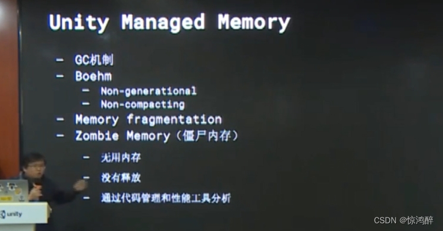

**怎么避免内存碎片--对象池**

什么是内存？

内存分为物理内存、虚拟内存

1.物理内存  

也就是我们真是的硬件设备，例如内存条。

这里引出一个概念：我们需要知道，CPU访问内存是一个慢速过程。

访问过程具体为：先访问Cache，Cache包含L1，L2，L3，也就是一级缓存，二级缓存和三级缓存，若在这些缓存里全没找到我们要的数据，再去访问内存，接着会把找到的数据存放到Cache中，完成一次操作。

在Cache中没有找到数据，我们称之为Cache Miss。因此过多的Cache Miss就会导致大量的内存和Cache的IO交换，浪费大量时间。

因此我们需要尽量减少Cache Miss，来提高访问速度，Unity为此提出了ECS方案，它们可以将存储在内存中的不连续数据，变为连续的数据，从而降低Cache Miss的概率。

在Unity中使用ECS（Entity Component System）模式可以帮助使数据变得更加连续，主要是因为ECS的架构方式与传统的面向对象编程（OOP）有很大的不同。ECS强调的是数据的组织和访问模式，而不是传统的对象封装。这种方法对于游戏开发特别有用，因为它能更高效地利用现代CPU的架构，特别是缓存系统，从而提高性能。以下是ECS如何实现数据连续性的几个关键点：

1. 组件存储：在ECS中，组件是附加到实体上的数据。这些组件通常按类型存储在紧密打包的数组中。因此，所有相同类型的组件都存储在连续的内存块中。这种存储方式使得数据访问模式变得非常高效，因为它优化了CPU的缓存利用率，减少了缓存未命中的次数。

2. 系统操作：ECS中的系统会对具有特定组件集合的实体执行操作。由于相同类型的组件数据是连续存储的，当系统遍历这些组件进行处理时，它能够以非常高效的方式进行，因为大部分数据访问都是顺序且预测性好的。这减少了内存读取延迟，提高了数据处理速度。

3. 避免内存碎片：如前所述，传统OOP在频繁创建和销毁对象时容易产生内存碎片。而ECS通过其组件数据的存储方式，避免了这种碎片化。即使实体被创建和销毁，组件数据的连续存储也能够保持，因为它们是在**大块的连续内存**中管理的。

4. 数据驱动设计：ECS鼓励使用**数据驱动**的设计方法。这意味着游戏的行为和逻辑更多地依赖于数据的组织和处理，而不是对象之间的交互。这种方法自然促进了数据的连续性和高效访问。

总之，ECS模式通过其独特的组件存储方式和对系统的高效数据访问，使得数据以连续的形式存储成为可能。这种方法不仅提高了内存访问的效率，还有助于提高整个游戏的性能。

2.虚拟内存

虚拟内存是利用磁盘空间虚拟出的一块逻辑内存，用作虚拟内存的磁盘空间被称为交换空间（Swap Space）。

声明。

​                        

**内存碎片、僵尸内存**

采用分区式存储管理的系统，在储存分配过程中产生的、不能供用户作业使用的主存里的小分区称成“**内存碎片**”。**例： 现在可用内存空间为3，但是，这3个空闲空间，并不是连续的。 所以，如果程序现在申请长度为3的内存空间，同样会申请不了，会出现内存不够的情况。**

避免Unity中的内存碎片化是提高游戏性能和稳定性的关键。内存碎片化通常发生在频繁地创建和销毁对象时，导致可用内存被分割成小块，从而影响性能。以下是一些避免内存碎片化的策略：

1. 对象池（Object Pooling）：最常用且有效的策略之一。预先创建一定数量的对象并在需要时重用这些对象，而不是频繁地创建和销毁。适用于游戏中经常出现的对象，如子弹、敌人或特效。

2. 优化资源加载：尽可能使用AssetBundle或Addressables来管理资源，这样可以更有效地加载和卸载资源，减少因资源管理不善而导致的内存碎片。

3. 减少字符串操作：字符串操作（尤其是在循环中）会产生很多**临时对象**，从而增加内存碎片。尽量避免在更新循环（Update）中进行字符串拼接等操作，考虑使用`StringBuilder`类来处理字符串。

4. 使用非托管内存：对于高级开发者，可以直接使用非托管内存来手动控制内存的分配和释放。这种方法可以避免.NET的垃圾回收机制引起的内存碎片，但需要谨慎使用，因为不当的内存管理可能导致内存泄漏。

5. 合理安排内存分配时机：尽量避免在游戏运行中的高频次循环中分配内存，比如可以在场景加载时预先分配好需要的内存。

6. 利用Unity Profiler分析：使用Unity的Profiler工具来监视和分析游戏的内存使用情况，特别是注意内存分配的峰值和频率，从而找到内存碎片化的源头并进行优化。

7. 垃圾回收策略：理解并优化.NET的垃圾回收（GC）策略。虽然不能直接控制GC，但可以通过减少临时对象的创建，手动触发GC在适当的时机，来减少GC的性能影响。

实现这些策略需要对Unity和C#有深入的了解，但通过减少内存碎片化，可以显著提高游戏的性能和稳定性。

**内存泄漏(僵尸内存)**产生的原因比较简单明确，就是申请的内存已经不需要再次被使用了，但是并没有归还给内存分配器（管理器）或者系统。、

