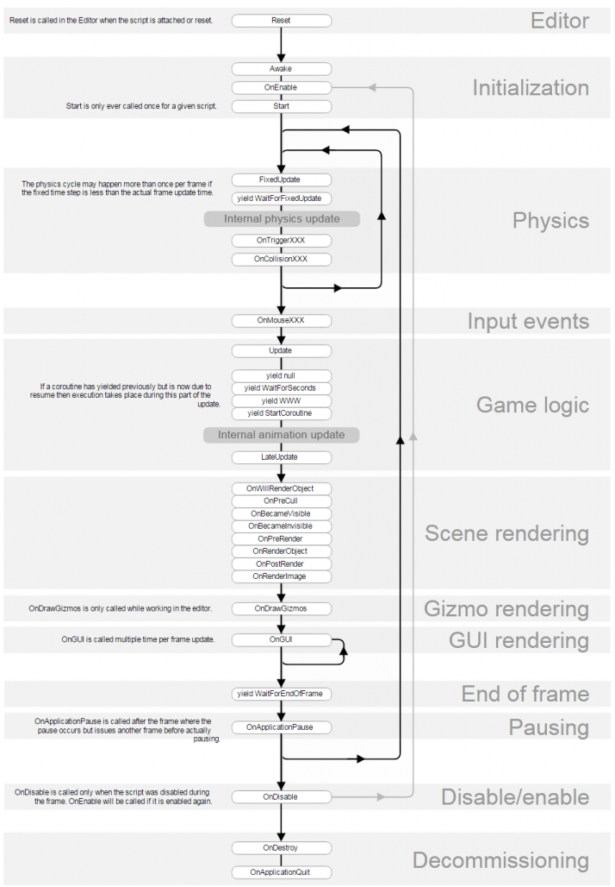
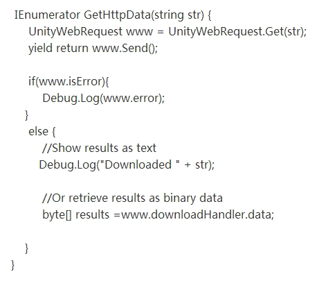

多线程写过吗->unity主线程相关，业务逻辑，unity为何在主线程中执行所有api

unity内的线程

定律

**1. UnityEngine的API与对象都不能在子线程中运行。**

**2. UnityEngine定义的基本结构(int,float,Struct定义的数据类型)可以在子线程中运行。**例如Vector3(Struct)可以，但Texture2d对象则不可以，因为其根父类为UnityEngine.Object)。

即：Unity3D中的子线程无法运行Unity SDK API。

**Unity主循环是单线程，游戏脚本MonoBehavior有着严格的生命周期**

为什么要做这个限制？因为游戏中逻辑更新和画面更新的时间点要求有确定性，必须按照帧序列严格保持同步，否则就会出现游戏中的对象不同步的现象。多线程也能保证这个效果，但如果引入多线程，会加大同步处理的难度与游戏的不稳定性

unity内的协程

Unity是一种游戏引擎，其设计是单线程的，这意味着在大多数情况下，所有游戏逻辑和渲染都在同一个线程上执行。为了处理异步任务，**Unity更倾向**于使用协程来实现，而不是传统的多线程。协程是一种轻量级的线程，它通过时间切片的方式在主线程上执行异步操作，这样可以避免多线程带来的复杂性和潜在的线程安全问题。时间切片指的是将一个时间段分割成小的时间片段，并且在这些时间片段内执行不同的任务或操作。在Unity中，协程使用时间切片来在主线程上执行异步任务。这意味着协程会在每一帧的执行过程中分配一小段时间来执行其任务，然后在下一帧继续执行剩余的任务，以此类推，直到完成所有任务。这种方式使得异步任务可以在不阻塞主线程的情况下逐步完成，从而保持游戏的流畅性。

线程是操作系统级别的概念，现代操作系统都实现并且支持线程，线程的调度对应用开发者是透明的，开发者无法预期某线程在何时被调度执行。基于此，一般那种随机出现的BUG，多与线程调度相关

而协程Coroutine是编译器级的，本质还是一个线程时间分片去执行代码段。它通过**相关的代码使得代码段能够实现分段式的执行，显式调用yield函数后才被挂起，重新开始的地方是yield关键字指定的，一次一定会跑到一个yield对应的地方。因为协程本质上还是在主线程里执行的，需要内部有一个类似栈的数据结构，当该coroutine被挂起时要保存该coroutine的数据现场以便恢复执行。

在Unity3D中，协程是可自行停止运行 (yield)，直到给定的 YieldInstruction 结束再继续运行的函数。

也就是说，将代码段分散在不同的帧中，每次执行一段，下一帧再执行yield挂起的地方。

举个例子： 在OnStart()框架函数中调用startCoroutine(GetHttpData)执行以下代码端，其实是第一次发起网络请求，下一次执行时则走入yield之后的代码段继续执行，从而实现了一个时间分片的”异步”效果，而不是像线程那样在操作系统层面分CPU时间片去执行。

unity如何使用子线程

线程中常用的方法:

1)线程对象.Start();开启线程2)线程对象.AbOrton();终止线程

3)线程对象.Join();将当前线程睡眠，等待线程对象执行完成后，将继续执行下面的代码

线程池:可以用来在后台执行多个任务的线程的集合。

可以协助主线程自由的异步执行其他任务。

线程池通常用于服务器应用程序(网络应用)，每个传入的请求都将分配给线程池中的一个线程，进行异步的处理请求，而不用占用主线程,也不会延迟后续的请求的处理，一旦池中的某个线程完成后，它将返回到等待线程队列中，等待再次被使用。

这种线程对象的重用是的应用程序可以避免为每个任务建立新的线程开销，从而提高开发效率。

线程池通常具有做大线程数目的限制，如果所有的线程都很繁忙，则额外的任务将方法队列中，知道有线程可用时才能得到对应的处理。

可以自己通过线程类和集合类实现线程池，也可以使用系统提供的线程池类ThreadPool

注意:一般使用线程池来处理用的较短的任务，如果线程需要一直运行，应该自己使用Thread开启线程。

using System;

using System.Threading;

namespace Duoxiancheng02

{

​    class MainClass

​    {

​        static void DownloadMovie()

​        {

​            Debug.Log ("下载视频"+Thread.CurrentThread.ManagedThreadId);

​            //休眠

​            Thread.Sleep(3000);

​            Debug.Log ("下载完成");

​        }

​        public static void DownloadMovie1(object fileName)

​        {

​            Debug.Log ("下载视频"+fileName.ToString());

​            Thread.Sleep(3000);

​            Debug.Log ("下载完成");

​        }

​        public static void MyThreadMethod(object state)

​        {

​            Debug.Log ("线程开始："+Thread.CurrentThread.ManagedThreadId);

​            Thread.Sleep (2000);

​            Debug.Log ("线程结束");

​        }

​        public static void Main (string[] args)

​        {

​            //通过Thread类开启线程

​            //Thread.CurrentThread:获取当前线程

​            //Debug.Log (Thread.CurrentThread.ManagedThreadId);

​            //DownloadMovie ();

​            //1.创建Thread类对象,当前线程并没有开启

​            //Thread thread=new Thread(DownloadMovie1);

​            //开启执行线程

​            //thread.Start();

​            //线程开启带参数的方法

​            //thread.Start("xxxx.mp4");

​            

​            //当前开启的线程thread对主线程中的语句没有影响

​            //Debug.Log ("当前是在主线程中....");

​            //2.使用Lambda表达式创建线程

//            Thread thread1=new Thread(()=>{

//                Debug.Log ("下载视频"+Thread.CurrentThread.ManagedThreadId);

//                Thread.Sleep(2000);

//                Debug.Log ("下载完成");

//            });

//            thread1.Start ();

//            //3.将线程要传递的参数封装到类中

//            MyThread my=new MyThread("http:hh.xxx.aaa","mmm.avi");

//            //开启线程

//            //这里可以传递静态方法和普通方法

//            Thread thread2= new Thread (my.DownLoadFile);

//            thread2.Start ();

//            //当前线程（主线程）被休眠，需要等待thread2执行完成后继续执行下面的代码

//            thread2.Join ();

//            Debug.Log ("这是下面的代码");

​           

​            ThreadPool.QueueUserWorkItem (MyThreadMethod);

​            ThreadPool.QueueUserWorkItem (MyThreadMethod);

​            ThreadPool.QueueUserWorkItem (MyThreadMethod);

​            ThreadPool.QueueUserWorkItem (MyThreadMethod);

​            ThreadPool.QueueUserWorkItem (MyThreadMethod);

​            ThreadPool.QueueUserWorkItem (MyThreadMethod);

​            ThreadPool.QueueUserWorkItem (MyThreadMethod);

​            ThreadPool.QueueUserWorkItem (MyThreadMethod);

​        }

​    }

}