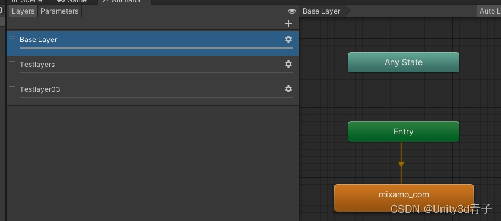

\1. 状态机概念介绍

在Unity中，动画状态机（Animator State Machine）是一种强大的工具，用于控制游戏对象的动画行为。动画状态机由多个动画状态Animation和过渡条件Transition、层组成！而层（Layers）是其中一个关键概念。

欢迎来到Unity的动画世界，这里简直比糖果屋还要甜美！🌈✨我们不仅仅是在操控一群静态的模型，我们要给它们穿上生动的戏服，让它们在你的游戏里如梦如幻地舞动！而这一切都离不开Unity的神奇工具——动画状态机。🎩✨

动画状态机就像是你的游戏中的导演，负责编排角色的一系列动作。想象一下，你有一个勇敢的骑士，他可以走路🚶‍♂️、挥舞剑⚔️、还能高喊口号🗣️。这些就是我们的动画状态，每个状态就是一个场景，一个角色在其中表演不同的戏码。

有趣的地方在于，这些状态之间并不是僵硬的切换，而是通过过渡来实现自然而流畅的转变。比如，当骑士从走路状态突然遇到敌人，动画状态机会像变魔术一样，通过设置的条件，让他迅速从走路转变成挥舞剑的战斗状态。这就是我们的过渡，一种无缝连接动画的魔法通道。✨✨

而层，则是我们动画的分层叠加。就像是一块画布，你可以在上面叠加各种元素。这就允许你的骑士同时进行多个动作，比如他可以一边走路，一边挥舞剑，一边高呼口号。这就是层的魔力，让你可以同时展示多个层次的动画。🎭✨

在代码中，你就是这场戏的编剧。通过简单的代码，你可以调控动画状态机的各个参数，让角色在游戏中舞动起来。按下W键，就是开启了骑士的走路状态，再按下空格键，他就会迅速切换到挥舞剑的状态。🎮✨

总之，动画状态机就是你在游戏中编织梦幻般动画的一张巨大画布，而你就是这场戏的导演和编剧。释放你的创造力，让你的角色在Unity的舞台上娓娓道来，成为游戏中最炫丽的一道风景。🚀🎉

\2. 层作用

动画状态机中的层起到了动画混合和组织的作用。它使得开发者可以将不同的动画分别放置在不同的层中，通过调整权重和设置过渡条件，实现更复杂的动画效果。

当谈到Unity的Animator State Machine时，层（Layer）简直是那位不可或缺的魔法师。🎩✨层的作用就像是给你的动画剧场增添了一份神秘的魔法菜单，让你可以同时享受多个动画的盛宴。

2.1. 层是什么？

想象一下，你的游戏是一场精彩的演出，每个动画状态都是不同的节目，而层就是你的剧场布景。每个层都是一个独特的画布，上面可以绘制不同的角色和动画效果。比如，你可以在一个层上放上主角的走路状态，另一个层上放上招手的状态，这样它们可以同时展示而不互相干扰。

2.2 为何需要层？

层的妙处在于，它允许你在同一时刻展示多个动画，就像舞台上同时上演多个场景一样。这为你的游戏增加了更多的维度和深度，让动画变得更加生动有趣。但是这个同时展示需要设置权重分配！

2.3. 在游戏中的实际应用

假设你的游戏主人公是一只可爱的猫咪。你希望这只猫咪既能够走路，又能够挥动着它那肥嘟嘟的小爪子，甚至还能够在一旁摇头晃脑。这时候，层就派上用场了。

在一个层上，你可以设置猫咪走路的动画状态，另一个层上设置挥爪动画状态，再在第三个层上设置摇头动画状态。这样，你的猫咪就可以在游戏中同时展现出这些动画，不再被单一的状态所束缚。

\3. 在游戏中的实际用途

层的实际用途非常广泛，特别是在需要处理多个动画状态混合的情况下。例如，在角色控制中，你可能有走路、跑步、攻击等多个动画，通过使用层，你可以更好地管理和控制这些动画的切换和过渡。

\4. 以走路、招手、摇头三个为例，详细讲解设置步骤

让我们开始一场精彩的动画旅程，以走路、招手、摇头这三个动作为例，我们将一一揭秘它们在Animator State Machine中的设置步骤。

 步骤一：准备动画资源

首先，确保你已经有走路、招手和摇头的动画资源。这可以是导入的外部动画文件，也可以是在Unity中制作的动画片段。

设置mask

\## 步骤二：创建动画控制器

在Unity的项目资源窗口中，右键点击空白处，选择`Create` > `Animator Controller`，然后为其命名。将Animator Controller与你的角色或对象的Animator组件相关联。

\## 步骤三：打开Animator视图

双击创建的Animator Controller，打开Animator视图。在这里，你将看到Animator State Machine的舞台，准备开始布置你的动画。

\## 步骤四：添加动画状态

在Animator视图中，你将看到一个空白的状态机。右键点击空白处，选择`Create State` > `Empty`，这将是我们的初始状态。重命名这个状态为“Idle”表示空闲状态，即初始状态。

接下来，为走路、招手和摇头分别创建动画状态。右键点击空白处，选择`Create State` > `From Motion...`，然后选择对应的动画资源文件。分别命名这三个状态为“Walk”、“Wave”和“Nod”。

\## 步骤五：创建层

在Animator视图的左下角找到“Layers”选项，点击“Add Layer”按钮，创建三个层，分别命名为“WalkLayer”、“WaveLayer”和“NodLayer”。

\## 步骤六：设置层中的动画状态

在每个层中，将对应的动画状态拖拽到相应的层上。例如，将“Walk”状态拖到“WalkLayer”上。这样，每个层就拥有了对应的动画状态。

步骤七：设置权重和过渡条件

点击每个层，你可以在Inspector面板中找到“Weight”属性，调整每个层的权重。设置权重决定了每个动画状态的影响程度，权重越高，该状态的动画越明显。

在Animator视图的左下角，你会看到“Layers”选项。点击这个选项，你会看到每个层的名称以及一个“Weight”滑块。在这里，你可以设置每个层的权重，数值范围在0到1之间。以下是步骤：

点击“Layers”选项，确保每个层的权重都被设置为适当的值。比如，“WalkLayer”可以设置为0.8，表示对应的走路状态在整体动画中占有很大的比例。

类似地，设置“WaveLayer”和“NodLayer”的权重，根据你希望的动画比例进行调整。

代码中的修改权重来调节动画融合情况：

在代码中，我们通过 SetLayerWeight 方法来调整每个层的权重