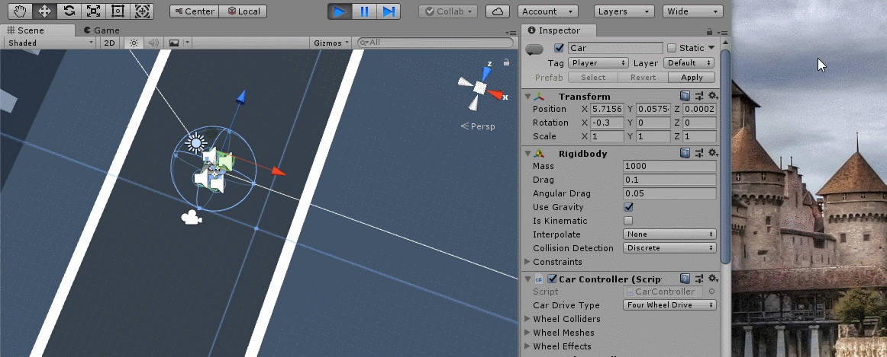

摘要：IK是Inverse Kinematic的缩写，也就是反向动力学。是根据骨骼的终节点来推算其他父节点的位置的一种方法。比如通过手的位置推算手腕、胳膊肘的骨骼的位置。

“非常棒！这是IK最常见的一种用途。其他的用途其实还有比如：角色的头的旋转，这样可以和你视角的方向一致。角色的脚的位置，这样可以让角色踩在地面跟贴合。”

“**Unity中IK能设置的部位就是5个，分别是：头、左右手、左右脚。**所以没有其他部位的IK了，我们常见的其实也都是这些。”

大智：“我们先来看看如何设置人物的头部根据视角旋转。需要用到这两个API：Animator.SetLookAtPosition和Animator.SetLookAtWeight，对应的方法为：”

public void SetLookAtPosition(Vector3 lookAtPosition);

“这个方法用来设置头部看向的位置，比如看向你左边的窗户，头就会相应的旋转。

public void SetLookAtWeight(float weight, float bodyWeight = 0.0f, float headWeight = 1.0f, float eyesWeight = 0.0f, float clampWeight = 0.5f);

“这个方法用来设置IK的权重，这个IK会和原来的动画进行混合。如果权重为1，则完全用IK的位置旋转；如果权重为0，则完全用原来动画中的位置和旋转。

至少要设置第一个参数，后面的几个参数都有默认值，但是你也要了解所有参数的含义：”

Weight 全局权重，后面所有参数的系数

bodyWeight 身体权重，身体参与LookAt的程度，一般是0

headWeight 头部权重，头部参与LookAt的权重，一般是1

eyesWeight 眼睛权重，眼睛参与LookAt的权重，一般是0（一般没有眼睛部分的骨骼）

clampWeight 权重的限制。0代表没有限制（脖子可能看起来和断了一样），1代表完全限制（头几乎不会动，像是固定住了）。0.5代表可能范围的一半（180度）。

大智：“有了这两个方法你就可以实现头部的IK了，不过还有两点需要注意：”

1、需要勾选对应Layer的IK Pass选项（在Layer的设置里）。

2、代码需要写在OnAnimatorIK这个事件方法里面。

void OnAnimatorIK(int layerIndex)

{

​    _animator.SetLookAtPosition(pos);

​    _animator.SetLookAtWeight(1);

}

上面的代码就是人物的头部看向一个位置的代码。需要注意的是这个OnAnimatorIK方法有一个参数layerIndex，这个就是对应的Layer的序号，只有勾选了IK Pass的layer才会调用到这个方法里，每个勾选了IK Pass的layer调用一次。

手脚IK

小新：“那手脚的IK是不是也跟这个类似的？”

大智：“是的，手脚的IK是和这个类似的，不过API有些不一样，我们来看看”

public void SetIKPosition(AvatarIKGoal goal, Vector3 goalPosition);

public void SetIKRotation(AvatarIKGoal goal, Quaternion goalRotation);

设置头部时，因为头不会移动，所以只需要设置LookAt的位置，头部跟随旋转即可。

但是对于手和脚，需要同时设置位置和旋转。

goal AvatarIKGoal枚举类型，包含：

LeftFoot 左脚

RightFoot 右脚

LeftHand 左手

RightHand 右手

goalPosition/goalRotation IK目标位置/旋转

同样还有设置权重的API：

public void SetIKPositionWeight(AvatarIKGoal goal, float value);

public void SetIKRotationWeight(AvatarIKGoal goal, float value);

goal AvatarIKGoal枚举类型

value IK的权重，1代表完全使用IK值，0代表使用原动画的值

常见的设置手部IK的代码是（一般需要4行代码设置一个部位）：

void OnAnimatorIK(int layerIndex)

{

​    _animator.SetIKPosition(AvatarIKGoal.LeftHand, position);

​    _animator.SetIKPositionWeight(AvatarIKGoal.LeftHand, 1);

​    _animator.SetIKRotation(AvatarIKGoal.LeftHand, rotation);

​    _animator.SetIKRotationWeight(AvatarIKGoal.LeftHand, 1);

}

小新：“大智，这个IK的位置好难调整啊，我想让角色拿枪的手能够贴合这个枪，有没有什么简单的办法？我这调了一个多小时了，还不是特别完美。。。”

大智：“调IK是个慢活，不过呢，确实有一些小技巧在里面。IK相关的代码涉及到位置和旋转，这时候不要傻傻的直接定义一个位置和旋转来手动设置，最好的办法是设置两个参照物，作为IK的位置和旋转的参考，这样只需要调这两个参照物就可以了。”

小新：“对对对，这样的话就不用去修改位置和旋转的值，而是直接修改这俩参照物的位置和旋转就可以了。我来试一下。”

小新：“太棒了，这样我就能在运行时调整这个参考位置，调到一个完美的位置和角度。”

小新三下五除二，就调到了一个合适的位置和角度。

“调好了！”小新高兴地喊道，随即退出了Play状态。

大智：“高兴早了吧？你这么就退出来了，修改的能保存下来么？”

小新：“啊。。。我给忘了，那这怎么办，运行时的修改保存不下来啊。。。”

大智：“快想想，我之前教过你一个小技巧，可以保存运行时的数据，不能这么快就给忘了吧？”

小新：“我有印象你教过我，不过这么久一直没实际用到过，哪能记得清啊”

大智：“那我再教你一遍，这次可得记好了。”

小新：“一定一定，再忘了我就……我就……再问你一遍，哈哈哈哈”

大智：“皮一下很开心？记好了，点击Transform组件右上角的小图标，可以Copy Component，在运行时点击，退出运行后，再点击小图标，选择Paste Component Values，这样就可以将数据粘贴回来了。”

在Inspector的Transform的右上角，点击齿轮小图标，选择Copy Component Values

退出Play模式

在Inspector的Transform的右上角，点击齿轮小图标，选择Paste Component Values

小新：“哦~~我回忆起来了，这次绝对不会再忘记了”

总结

小新：“有了IK，人物就能更符合游戏的需要了，而且可以根据不同的情形动态调整，人物就不会那么呆呆的了。”

“看来小新对IK的理解还是挺深的。”