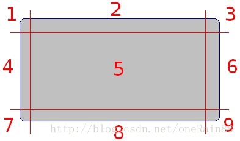
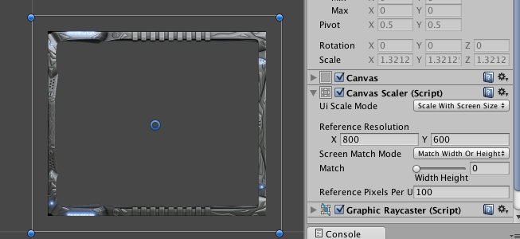
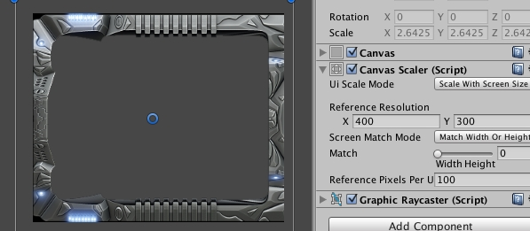

**原理**

把纹理用4条线分割成9部分（如上图），通过观察可以发现，5是最规则的形状（矩形），其次是2,6,8,4（矩形，但是和四个角有公共边），最后是四个角1,3,9,7（圆角矩形）

规则的图形在拉伸之后的效果是比较好的，如果是不规则的图形，则会在拉伸之后变形！

根据上图做拉伸制定规则：

**（1）保证四个角1,3,9,7不做任何拉伸 （2）与四个角有公共边的四个矩形2,6,8,4做单向拉伸，即保证与四个角的公共边不拉伸，例如2,8只进行横向拉伸，4,6只进行纵向拉伸 （3）中间部分5做双向拉伸，即横向，纵向同事拉伸**

下面就讲讲Unity3d中使用ugui中如何使用九宫格：

选中纹理资源，点击下图中红框按钮，打开sprite编辑器：

设置sprite的边界，其中蓝色的为可用图片边界，绿色线则为九宫格的裁剪线，初始时，蓝色和绿色重叠，鼠标放在下图中绿色节点上即可编辑九宫格裁剪线：

设置好图片后，就可以把sprite赋值给ui，看效果去了，并将图片类型选择为sliced，还要记得勾上Fill Center（中心填充）

补充：

在修改为10后（原来是100）

各位应该是看到区别了，当canvas或者是图片的每单位多少像素修改后，图片大小显示大小其实是不一样的。如果图片设置为10，canvas设置为100，那就相当于九宫格中非中心的图片区域大小缩放了10倍，而我由于测试过canvas参数，将其改为1，后来见没效果，没有改为100，结果可想而知，我所有九宫格在sliced模式下，只能看到九宫格中心区域。如果不仔细看，边缘区域根本不可见。