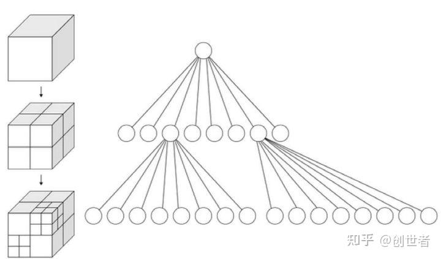

➕

在Unity中，如果你希望在无需使用物理引擎的情况下实现敌人之间的检测，可以使用一些优化方法，例如基于距离的检测或者分区检查。


## 1. 距离检测

你可以通过计算敌人之间的距离来判断它们是否相互接近。这种方法简便且直观。FindObjectsOfType

```csharp
void Update()
{
    Transform[] enemies = FindObjectsOfType<Transform>(); // 获取所有敌人的Transform
    float detectionRange = 5f; // 检测范围

    for (int i = 0; i < enemies.Length; i++)
    {
        for (int j = i + 1; j < enemies.Length; j++) // 避免重复计算
        {
            if (Vector3.Distance(enemies[i].position, enemies[j].position) < detectionRange)
            {
                // 处理敌人之间的检测逻辑
                Debug.Log($"{enemies[i].name} and {enemies[j].name} are close.");
            }
        }
    }
}
```


## 2. 使用空间分区（如网格/八叉树）

为了避免每帧都检查所有敌人，可以采用**空间分区**技术，比如将场景划分成网格或八叉树。当敌人移动时，你可以将其位置更新到对应的格子或节点中，只在邻近的格子或节点中进行检测。你可以实现一个简化的八叉树类，然后根据敌人的位置将其插入到合适的节点中，接着只检查那些节点中的敌人。


### 八叉树出现前提：

当我们要做**物理碰撞检测**的时候，例如一枚子弹射了出去，我们或许会选择**遍历**所有的物体，通过运算判断是否相交，是否发生碰撞，**但这不理想**，尤其是面对**成千上万**物体的时候，计算量极其恐怖。
同样的，在面对光线计算，遮挡关系计算中也有这个问题。
事实上，如果让我们也这样做，即从头看到尾，依次遍历，寻找**碰撞**，也未必迅速。但是我们能很快发现发生碰撞的物品，为什么？

> **因为我们会进行一个潜在的分区，只看\*可能会碰撞的位置\***

这就是我们的思路，尝试进行分区，然后遍历分区内的物体； 八叉树就这样诞生了




### 八叉树定义：

八叉树（Octree）是一种用于描述三维空间的树状数据结构。八叉树的每个节点表示一个正方体的体积元素，每个节点有八个子节点，这八个子节点所表示的体积元素加在一起就等于父节点的体积。一般中心点作为节点的分叉中心。

### 八叉树算法思想：

(1). 设定最大**递归**深度。

(2). 找出场景的最大尺寸，并以此尺寸建立**第一个**立方体。

(3). 依序将单位元元素丢入能被包含且没有子节点的立方体。

(4). 若没达到最大递归深度，就进行细分八等份，再将该立方体所装的单位元元素全部分担给八个子立方体。

(5). 若发现子立方体所分配到的单位元元素数量不为零且跟父立方体是一样的，则该子立方体停止细分，因为跟据空间分割理论，细分的空间所得到的分配必定较少，若是一样数目，则再怎么切数目还是一样，会造成无穷切割的情形。

(6). 重复3，直到达到最大递归深度。


### 八叉数实现细节（定义）：

```c#
public class OctreeNode  
{  
    public Vector3 center;  
    public float size;//中心与大小用来判断物体是否在内部
          
	private const int kidCount = 8; //固定八叉树
    public List<GameObject> areaObjects;  
    private OctreeNode[] kids;//子节点  
    
    public OctreeNode(Vector3 center, float size)  
    {        
	    kids = new OctreeNode[kidCount];  
        this.center = center;  
        this.size = size;  
        areaObjects = new List<GameObject>();  
    }   
    
    //四个上面的节点（立方体上半）
    public OctreeNode top0  
    {  
        get { return kids[0];}  
        set { kids[0] = value; }  
    }  
    public OctreeNode top1  
    {  
        get { return kids[1];}  
        set { kids[1] = value; }  
    }
    public OctreeNode top2  
    {  
        get { return kids[2];}  
        set { kids[2] = value; }  
    }
    public OctreeNode top3  
    {  
        get { return kids[3];}  
        set { kids[3] = value; }  
    }
    
	
	//四个下面的节点（立方体下半）
    public OctreeNode bottom0  
    {  
        get{ return kids[4];}  
        set { kids[4] = value; }  
    }  
    public OctreeNode bottom1  
    {  
        get{ return kids[5];}  
        set { kids[5] = value; }  
    }  
    public OctreeNode bottom2  
    {  
        get{ return kids[6];}  
        set { kids[6] = value; }  
    }  
    public OctreeNode bottom3  
    {  
        get{ return kids[7];}  
        set { kids[7] = value; }  
    }  
   
    
    public int objectCount => areaObjects.Count;  
  
    public void DrawGizmos()  
    {        
	    Gizmos.DrawWireCube(center, Vector3.one * size);  
    }  
    
    //是否包含该物体
    public bool Contains(Vector3 position)  
    {        
	    var halfSize = size * 0.5f;  
        return Mathf.Abs(position.x - center.x) <= halfSize &&  
               Mathf.Abs(position.y - center.y) <= halfSize &&  
               Mathf.Abs(position.z - center.z) <= halfSize;  
    }          

    public void AddGameobject(GameObject go)  
    {        
	    areaObjects.Add(go);  
    }          
}
```


### 八叉树实现细节（控制）：

```c#
public class OctreeNodeCon : MonoBehaviour  
{  
    public OctreeNode root;  
    private List<GameObject> sceneObjects;  
    [Range(0, 500)] public int genCount = 100;  
    [Range(1, 8)] public int buildDepth;  
    [Range(1, 300)] public float range = 100;  
          
  
    [Range(0, 8)] public int displayDepth = 3;  
    public bool showOctree = true;  
    public OctreeDebugMode octreeDebugMode;  
    public Color[] displayColor;  
    // 检测信息  
    public bool showQueryResult = true;  
    public GameObject checkTarget;  
    private List<GameObject> queryObjects;  
    private OctreeNode queryNode;  
    
    private void Start()  
    {        
	    GenSceneObjects();  
        OctreePartion();  
    }  
    
    private void Update()  
    {        
	    if (checkTarget != null)  
        {            
	        var position = checkTarget.transform.position;  
            if (root.Contains(position))  
            {                
	            var node = QueryOctTree(position, root);  
                if (node != null)  
                {                    
	                queryObjects = node.areaObjects;  
                    queryNode = node;  
                }            
            }            
            else  
            {  
                queryObjects = null;  
                queryNode = null;  
            }        
        }    
    }   
     
    // 查询八叉树  
    private OctreeNode QueryOctTree(Vector3 position, OctreeNode checkNode)  
    {        
	    if(checkNode == null)  
            return null;  
        if (checkNode.top0?.Contains(position) ?? false) return QueryOctTree(position, checkNode.top0);  
        if (checkNode.top1?.Contains(position) ?? false) return QueryOctTree(position, checkNode.top1);  
        if (checkNode.top2?.Contains(position) ?? false) return QueryOctTree(position, checkNode.top2);  
        if (checkNode.top3?.Contains(position) ?? false) return QueryOctTree(position, checkNode.top3);  
  
        if (checkNode.bottom0?.Contains(position) ?? false) return QueryOctTree(position, checkNode.bottom0);  
        if (checkNode.bottom1?.Contains(position) ?? false) return QueryOctTree(position, checkNode.bottom1);  
        if (checkNode.bottom2?.Contains(position) ?? false) return QueryOctTree(position, checkNode.bottom2);  
        if (checkNode.bottom3?.Contains(position) ?? false) return QueryOctTree(position, checkNode.bottom3);  
  
        return checkNode;  
    }    
    // 生成场景物体  
    private void GenSceneObjects()  
    {        
	    var genRang = range * 0.5f;  
        sceneObjects = new List<GameObject>();  
		for (int i = 0; i < genCount; i++)  
        {            
	        var obj = GameObject.CreatePrimitive(PrimitiveType.Cube);  
            obj.transform.position = new Vector3(Random.Range(-genRang, genRang), Random.Range(-genRang, genRang),  Random.Range(-genRang, genRang));  
            obj.hideFlags = HideFlags.HideInHierarchy;  
            sceneObjects.Add(obj);  
        }    
    }  
    // 生成八叉树  
    private void OctreePartion()  
    {        
	    var initialOrgin = Vector3.zero;  
        root = new OctreeNode(initialOrgin, range);  
        root.areaObjects = sceneObjects;  
        GenerateOctree(root, range, buildDepth);  
    }  
    // 递归生成八叉树  
    private void GenerateOctree(OctreeNode root, float range, float depth)  
    {        
	    if (depth <= 0)  
        {            
	        return;  
        }  
        var halfRange = range / 2.0f;  
        var rootCenter = root.center;  
        var rootOffset = halfRange / 2.0f;  
  
        var origin = rootCenter + new Vector3(-1, 1, -1) * rootOffset;  
        root.top0 = new OctreeNode(origin, halfRange);  
        
        origin = rootCenter + new Vector3(1, 1, -1) * rootOffset;  
        root.top1 = new OctreeNode(origin, halfRange);  
  
        origin = rootCenter + new Vector3(1, 1, 1) * rootOffset;  
        root.top2 = new OctreeNode(origin, halfRange);  
  
        origin = rootCenter + new Vector3(-1, 1, 1) * rootOffset;  
        root.top3 = new OctreeNode(origin, halfRange);  
  
        origin = rootCenter + new Vector3(-1, -1, -1) * rootOffset;  
        root.bottom0 = new OctreeNode(origin, halfRange);  
  
        origin = rootCenter + new Vector3(1, -1, -1) * rootOffset;  
        root.bottom1 = new OctreeNode(origin, halfRange);  
  
        origin = rootCenter + new Vector3(1, -1, 1) * rootOffset;  
        root.bottom2 = new OctreeNode(origin, halfRange);  
  
        origin = rootCenter + new Vector3(-1, -1, 1) * rootOffset;  
        root.bottom3 = new OctreeNode(origin, halfRange);  
        PartitionSceneObjects(root);  
  
        if (root.top0.objectCount >= 2)  
        {            
	        GenerateOctree(root.top0,halfRange,depth-1);  
        }  
        if (root.top1.objectCount >= 2)  
        {            
	        GenerateOctree(root.top1, halfRange, depth - 1);  
        }  
        if (root.top2.objectCount >= 2)  
        {            
	        GenerateOctree(root.top2, halfRange, depth - 1);  
        }  
        if (root.top3.objectCount >= 2)  
        {            
	        GenerateOctree(root.top3, halfRange, depth - 1);  
        }  
        if (root.bottom0.objectCount >= 2)  
        {            
	        GenerateOctree(root.bottom0, halfRange, depth - 1);  
        }  
        if (root.bottom1.objectCount >= 2)  
        {            
	        GenerateOctree(root.bottom1, halfRange, depth - 1);  
        }  
        if (root.bottom2.objectCount >= 2)  
        {            
	        GenerateOctree(root.bottom2, halfRange, depth - 1);  
        }  
        if (root.bottom3.objectCount >= 2)  
        {            
	        GenerateOctree(root.bottom3, halfRange, depth - 1);  
        }            
    }  
  
    // 将场景物体分配到八叉树节点  
    private void PartitionSceneObjects(OctreeNode root)  
    {        var objects = root.areaObjects;  
        foreach (var obj in objects)  
        {            
        if (root.top0.Contains(obj.transform.position))  
            {                
	            root.top0.AddGameobject(obj);  
            }            
        else if (root.top1.Contains(obj.transform.position))  
            {                
	            root.top1.AddGameobject(obj);  
            }            
        else if (root.top2.Contains(obj.transform.position))  
            {                
	            root.top2.AddGameobject(obj);  
            }            
	    else if (root.top3.Contains(obj.transform.position))  
            {                
	            root.top3.AddGameobject(obj);  
            }            
            else if (root.bottom0.Contains(obj.transform.position))  
            {                
	            root.bottom0.AddGameobject(obj);  
            }            
            else if (root.bottom1.Contains(obj.transform.position))  
            {                
	            root.bottom1.AddGameobject(obj);  
            }            
            else if (root.bottom2.Contains(obj.transform.position))  
            {                
	            root.bottom2.AddGameobject(obj);  
            }            
            else if (root.bottom3.Contains(obj.transform.position))  
            {                
	            root.bottom3.AddGameobject(obj);  
            }        
        }    
    }  
    // 绘制八叉树  
    public void OnDrawGizmos()  
    {        
	    if (root == null)  
            return;  
  
        if (showOctree && displayDepth <= buildDepth)  
        {            
	        if (octreeDebugMode == OctreeDebugMode.AllDepth)  
            {                
	            Gizmos.color = new Color(1, 1, 1, 0.2f);  
                DrawNode(root, displayDepth);  
            }            
            else if (octreeDebugMode == OctreeDebugMode.TargetDepth)  
            {                
	            if (displayColor.Length > displayDepth)  
                {                    
	                var color = displayColor[displayDepth];  
                    color.a = 0.2f;  
                    Gizmos.color = color;  
                    DrawTargetDepth(root,displayDepth);  
                }            
            }        
        }        
        if (showQueryResult)  
        {            
	        Gizmos.color = Color.green;  
            queryNode?.DrawGizmos();  
			if (queryObjects != null)  
            {                
	            Gizmos.color = Color.red;  
				foreach (var obj in queryObjects)  
                {                    
	                Gizmos.DrawWireSphere(obj.transform.position, 0.2f);  
                    Gizmos.DrawLine(checkTarget.transform.position, obj.transform.position);  
                }            
            }        
	    }    
	}  
    // 绘制目标深度的八叉树  
    private void DrawTargetDepth(OctreeNode node, int depth)  
    {        
	    if (node == null) return;  
        if (depth <= 0)  
        {            
	        node.DrawGizmos();  
            return;  
        }  
        var nextDepth = depth - 1;  
        
        var kid = node.top0;  
        DrawTargetDepth(kid, nextDepth);  
  
        kid = node.top1;  
        DrawTargetDepth(kid, nextDepth);  
  
        kid = node.top2;  
        DrawTargetDepth(kid, nextDepth);  
  
        kid = node.top3;  
        DrawTargetDepth(kid, nextDepth);  
  
        kid = node.bottom0;  
        DrawTargetDepth(kid, nextDepth);  
  
        kid = node.bottom1;  
        DrawTargetDepth(kid, nextDepth);  
  
        kid = node.bottom2;  
        DrawTargetDepth(kid, nextDepth);  
  
        kid = node.bottom3;  
        DrawTargetDepth(kid, nextDepth);  
    }    // 绘制所有深度的八叉树  
    private void DrawNode(OctreeNode node, int depth)  
    {        
	    if (node == null)  
            return;  
        if (depth > 0 && depth < displayColor.Length)  
        {            
	        var color = displayColor[depth];  
            color.a = 0.5f;  
            Gizmos.color = color;  
            node.DrawGizmos();  
        }  
        var kid = node.top0;  
        DrawNode(kid, depth - 1);  
  
        kid = node.top1;  
        DrawNode(kid, depth - 1);  
  
        kid = node.top2;  
        DrawNode(kid, depth - 1);  
  
        kid = node.top3;  
        DrawNode(kid, depth - 1);  
  
        kid = node.bottom0;  
        DrawNode(kid, depth - 1);  
  
        kid = node.bottom1;  
        DrawNode(kid, depth - 1);  
  
        kid = node.bottom2;  
        DrawNode(kid, depth - 1);  
  
        kid = node.bottom3;  
        DrawNode(kid, depth - 1);  
    }    
}  
  
public enum OctreeDebugMode  
{  
    AllDepth,  
    TargetDepth  
}
```


### 3. 使用Tile系统

类似于分区，可以使用一个Tile系统，每个Tile同时存储多个敌人。当敌人移动时，可以将其刮入当前的Tile。只需检查当前Tile及其邻近Tiles中的敌人即可。

### 4. 脚本可见性检测

有时可以选择只在敌人视野内进行检测。如果敌人有一个视锥体，可以使用射线检测（Raycast）或简单的角度计算来判断另一个敌人是否在其视野内。

