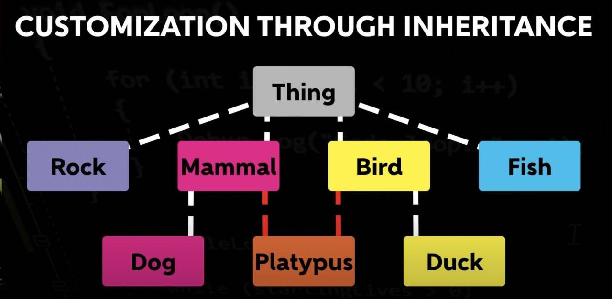
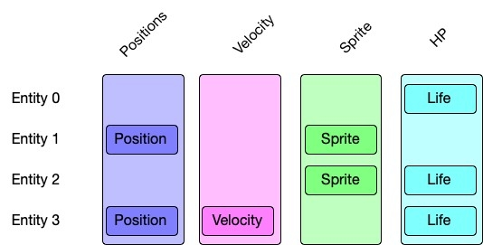

➕

## 面向对象 vs ECS

### 什么是ECS

Unity3DECS架构是基于实体组件系统（Entity-Component-System，ECS）设计的一种游戏开发架构。ECS是一种游戏开发中常用的设计模式，它将游戏对象（Entity）拆分成多个组件（Component），并通过系统（System）**对组件进行管理和处理**。与传统的面向对象设计模式相比，ECS更加灵活、高效和易于扩展。

Unity3DECS架构中，游戏对象被称为实体（Entity），组件被称为组件（Component），系统被称为系统（System）。

实体（Entity）只是一个标识符，不包含任何数据或行为，而组件（Component）则包含实体的数据和行为，系统（System）则负责对组件进行管理和处理。

所有的程序员都知道面向对象的编程模式，我们看下面向对象的实现有什么问题

假设一个游戏场景里有Dog、Platypus(鸭嘴兽)、Duck，继承关系如上图。

如果再有猎犬，猎犬又得继承自Dog的特性，如此，整个类层级结构就很**容易膨胀**、且变得难以维护。

解决面向对象层级结构的第一步，就是把"**继承关系**"重构成"**组合**"

ECS(Entity Component System)就是一种分拆、组合的实现。

面向对象的思想是把数据、行为都封装在**一个类**里，ECS有点像MVC，但是做的更彻底，边界划分的更清晰。

E：Entity，实体。一般用一个唯一值的int型表示，可以理解为一个ID。一个怪兽、一把枪，就是一个ID，至于怪兽的外观、血量、速度则是Component表示。

C：Component，组件，也可以理解为data。Component是个很泛的概念，所有的属性都能以Component的形式存在，如：怪兽的外观材质、速度、名字、位移、血量等

S：System，系统。类似MVC中的Controller，控制逻辑。可以按照Component的类别设计System种类

### ECS的优缺点

优点

性能较好内存：避免了因继承造成的冗余字段，以组合的方式按需拼装

IO：ECS利用了"局部性"，一次处理相同的数据类型，增加了缓存命中，

结构清晰，数据、逻辑充分解耦，更便于大型项目迭代

适合并发优化。可以针对没有依赖关系的数据并行计算。

缺点

基础框架比对面向对象复杂，习惯了面向对象编程，会有点不习惯

思路虽然更简单清晰，但是新增功能的代码会更多

逻辑分散，逻辑异常不如面向对象好调试

例子:

### 1.实体（Entity）

实体（Entity）是Unity3DECS架构中最基本的概念，它只是一个标识符，用于标识游戏对象。在Unity3DECS架构中，实体不包含任何数据或行为，它只是一个唯一的标识符，用于让系统（System）知道哪些组件（Component）属于哪个实体。

首先是Entity部分，我们需要创建一个Entity实体，并添加需要的组件。

using Unity.Entities;

public class CreateEntityExample : MonoBehaviour

{

​    void Start()

​    {

​        EntityManager entityManager = World.DefaultGameObjectInjectionWorld.EntityManager;

​        Entity entity = entityManager.CreateEntity();

​        // 添加Position组件

​        entityManager.AddComponentData(entity, new Position { Value = new float3(0, 0, 0) });

​        // 添加MoveSpeed组件

​        entityManager.AddComponentData(entity, new MoveSpeed { Value = 1.0f });

​    }

}

在这个示例中，我们使用 EntityManager 类创建了一个实体，并添加了 Position 和 MoveSpeed 组件。Position 组件表示实体的位置，MoveSpeed 组件表示实体的移动速度。

### 2.组件（Component）

组件（Component）是Unity3DECS架构中实现游戏对象功能的基本单元，它包含了游戏对象的数据和行为。在Unity3DECS架构中，组件（Component）是可复用的，可以在多个实体（Entity）之间共享。

接下来是Component部分，我们需要定义组件数据结构。

using Unity.Entities;

public struct Position : IComponentData

{

​    public float3 Value;

}

public struct MoveSpeed : IComponentData

{

​    public float Value;

}

在这个示例中，我们定义了 Position 和 MoveSpeed 两个组件，它们都继承自 IComponentData 接口，表示它们是纯数据类型的组件。

### 3.系统（System）

系统（System）是Unity3DECS架构中管理和处理组件（Component）的核心部分，它负责对**组件**进行管理和处理。系统（System）可以对所有拥有特定组件（Component）的实体（Entity）进行操作，例如**更新组件（Component）的状态**、处理组件之间的关系等。

最后是System部分，我们需要创建一个系统，并在其中**更新实体的位置**。

using Unity.Entities;

using Unity.Transforms;

using Unity.Mathematics;

public class MovementSystem : SystemBase

{

​    protected override void OnUpdate()

​    {

​        float deltaTime = Time.DeltaTime;

 

​        Entities.ForEach((ref Translation translation, in MoveSpeed moveSpeed) =>

​        {

​            float3 position = translation.Value;

​            position.x += moveSpeed.Value * deltaTime;

​            translation.Value = position;

​        }).ScheduleParallel();

​    }

}

### 4.实体管理器（EntityManager）

实体管理器（EntityManager）是Unity3DECS架构中管理实体（Entity）的核心部分，它负责创建、销毁、查询和管理实体（Entity）及其组件（Component）。

在Unity3DECS架构中，实体管理器（EntityManager）通常使用EntityManager类实现，例如：

public class GameManager : MonoBehaviour

{

private EntityManager entityManager;

private void Awake()

{

​    entityManager = World.DefaultGameObjectInjectionWorld.EntityManager;

}

private void Start()

{

​    Entity entity = entityManager.CreateEntity(typeof(Position), typeof(Movement));

​    entityManager.SetComponentData(entity, new Position { x = 0, y = 0, z = 0 });

​    entityManager.SetComponentData(entity, new Movement { speed = 5 });

}

}