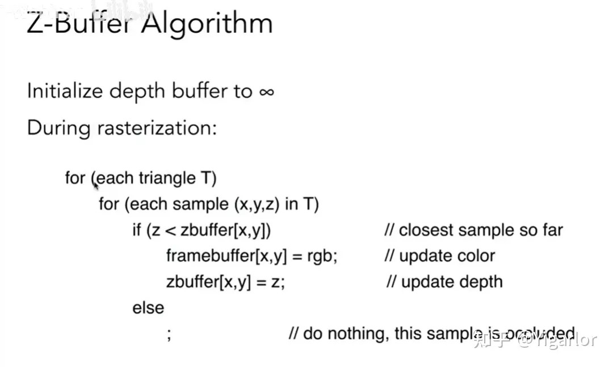

光栅化的深度缓冲

深度缓冲其实对于之前的软光栅课程已经说过了。这里简单介绍补充一下。

这个深度缓冲技术，目的是为了处理物体之间前后遮挡关系的。对于三角形直接投影后出现了投影到了相同的位置或者投影的位置相互交叉，那么最终应该显示谁的颜色呢？

所以zbuffer就来解决这一个问题了：

对于三角形顺序不好整，把视角放在像素上，像素之间进行排序就好了，因为我们的颜色显示是以像素为单位的，这里也绝不会出现顺序分不清的情况。

我们最后要生成的是一个图片，这个存在framebuffer中，而zbuffer和他是一样大小的，其中每一个值表示的是：这个值对应于一个像素，我们可能已经遇到了很多的三角形都会投影到该像素上，那么我当前的zbuffer记录的是过去投影到该像素的所有点谁是最靠近摄像机的，我会记录他的深度，同时像素目前也会是他的颜色，如果所有的三角形光栅化都操作完了，最后像素呈现的颜色，一定是距离摄像机最近的，也就是正确的答案。

详细的，我们先把zbuffer初始化为负无穷。然后去处理每一个三角形光栅化的时候，发现像素a在这个三角形内部，那么我们就看看zbuffer在该像素的值，如果说比三角形上的这个点的z值小（由于我们考虑摄像机是朝着-z轴的，所以这里z越大靠摄像机越近），那说明这个三角形的该点是更加靠近摄像机的。所以我们把zbuffer的值更改成该点的z值，然后把颜色改成该点的颜色。如果说是小于zbuffer的值，那说明和已经来过的人相比，你是比他距离摄像机更远的，那么直接pass。

大概整体这么一个过程，下面是伪代码（如果去看tinyrenderer软光栅教程，会有下面类似的手动实现。）：

关于复杂度的分析，这里其实并没有排队，只是记录最值而已，遍历的同时维护一个最值而已。

这里的zbuffer算法有一个明显的优点就是：和画的顺序没有关系！！！

**超大世界可能会因为浮点精度限制遭遇什么问题**

Z Buffer精度问题

在绝大多数3D图形学和游戏数学开发的书本和文章里，我们看到的相机设置都会有一个近裁剪面，一个远裁剪面，只有位于这两者之间的物体才能会被渲染到屏幕上。对于一般游戏来说，我们的裁剪距离可能只有几十到上百米，但对于大世界来说，可视距离可能长大几公里。

对于以公里计的可视距离，渲染所用的Z Buffer精度同样深受浮点数的精度问题困扰。它的精度集中的分布在0点附近。先看看距离在0到1之间的时候1/z的精度分布：

在此情形下远处的物体渲染容易出现Z Fight，会因渲染顺序而可能产生可视性的错误。对于Z Buffer的精度问题，常用的解决方是为z构造一个单调变换函数，使z的浮点数精度区间分布尽可能均匀。为此,Eugene Lapidous构造出了Reversed Z = 1-Z，这一算法只需一条指令，且对渲染来说也不过是把原来的LessEqual改为GreatEqual，精巧简洁。一个复杂的问题的解决，并不一定需要复杂的方案。

对于反转的深度值公式 $Z' = 1 - Z$，其影响主要体现在深度值的变换方式上。当原始深度值 $Z$ 在线性深度值范围内时（比如[0, 1]），应用反转公式后得到的新深度值 $Z'$ 也会在相同的范围内（同样是[0, 1]）。这种变换导致深度值的分布方式发生改变，可能使得Z-buffer的分辨率在不同深度区域更加均匀。

做为对比，使用Reversed Z之后的精度分布如下图所示：

