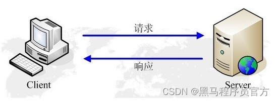
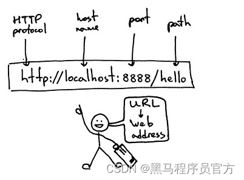

HTTP协议（HyperText Transfer Protocol，超文本传输协议）：是一种发布和接收 HTML页面的方法。

HTTPS（Hypertext Transfer Protocol over Secure Socket Layer）简单讲是HTTP的安全版，在HTTP下加入SSL层。

SSL（Secure Sockets Layer 安全套接层）主要用于Web的安全传输协议，在传输层对网络连接进行加密，保障在Internet上数据传输的安全。

HTTP的端口号为80

HTTPS的端口号为443

HTTP工作原理

网络爬虫抓取过程可以理解为模拟浏览器操作的过程。

浏览器的主要功能是向服务器发出请求，在浏览器窗口中展示您选择的网络资源，HTTP是一套计算机通过网络进行通信的规则。

HTTP的请求与响应

HTTP通信由两部分组成： 客户端请求消息 与 服务器响应消息

 

浏览器发送HTTP请求的过程：

当用户在浏览器的地址栏中输入一个URL地址并按回车键之后，浏览器会向HTTP服务器发送HTTP请求。HTTP请求主要分为Get和Post两种方法。

当我们在浏览器输入URL 好口碑IT培训机构,一样的教育,不一样的品质-传智教育官网 的时候，浏览器发送一个Request请求去获取 好口碑IT培训机构,一样的教育,不一样的品质-传智教育官网 的html文件，服务器把Response文件对象发送回给浏览器。

浏览器分析Response中的 HTML，发现其中引用了很多其他文件，比如Images文件，CSS文件，JS文件。 浏览器会自动再次发送Request去获取图片，CSS文件，或者JS文件等。

当所有的文件都下载成功后，网页会根据HTML语法结构，完整的显示出来了。

\> URL（Uniform / Universal Resource Locator的缩写）：统一资源定位符，是用于完整地描述Internet上网页和其他资源的地址的一种标识方法。

 

基本格式：scheme://host[:port]/path/…/[?query-string][#anchor]

scheme：协议(例如：http, https, ftp)

host：服务器的IP地址或者域名

port：服务器的端口（如果是走协议默认端口，缺省端口80）

path：访问资源的路径

query-string：参数，发送给http服务器的数据

anchor：锚（跳转到网页的指定锚点位置）

客户端HTTP请求

URL只是标识资源的位置，而HTTP是用来提交和获取资源。客户端发送一个HTTP请求到服务器的请求消息，包括以下格式：

请求行、请求头部、空行、请求数据

请求方法

GET https://www.baidu.com/ HTTP/1.1

根据HTTP标准，HTTP请求可以使用多种请求方法。

HTTP 0.9：只有基本的文本 GET 功能。

HTTP 1.0：完善的请求/响应模型，并将协议补充完整，定义了三种请求方法： GET, POST 和 HEAD方法。

HTTP 1.1：在 1.0 基础上进行更新，新增了五种请求方法：OPTIONS, PUT, DELETE, TRACE 和 CONNECT 方法。

HTTP 2.0（未普及）：请求/响应首部的定义基本没有改变，只是所有首部键必须全部小写，而且请求行要独立为 :method、:scheme、:host、:path这些键值对。

GET

请求指定的页面信息，并返回实体主体。

HEAD

类似于get请求，只不过返回的响应中没有具体的内容，用于获取报头

POST

向指定资源提交数据进行处理请求（例如提交表单或者上传文件），数据被包含在请求体中。POST请求可能会导致新的资源的建立和/或已有资源的修改。

PUT

从客户端向服务器传送的数据取代指定的文档的内容。

DELETE

请求服务器删除指定的页面。

CONNECT

HTTP/1.1协议中预留给能够将连接改为管道方式的代理服务器。

OPTIONS

允许客户端查看服务器的性能。

TRACE

回显服务器收到的请求，主要用于测试或诊断。

HTTP请求主要分为Get和Post两种方法

GET是从服务器上获取数据，POST是向服务器传送数据

GET请求参数显示，都显示在浏览器网址上，HTTP服务器根据该请求所包含URL中的参数来产生响应内容，即“Get”请求的参数是URL的一部分。 例如： http://www.baidu.com/s?wd=Chinese

POST请求参数在请求体当中，消息长度没有限制而且以隐式的方式进行发送，通常用来向HTTP服务器提交量比较大的数据（比如请求中包含许多参数或者文件上传操作等），请求的参数包含在“Content-Type”消息头里，指明该消息体的媒体类型和编码，

注意：避免使用Get方式提交表单，因为有可能会导致安全问题。 比如说在登陆表单中用Get方式，用户输入的用户名和密码将在地址栏中暴露无遗