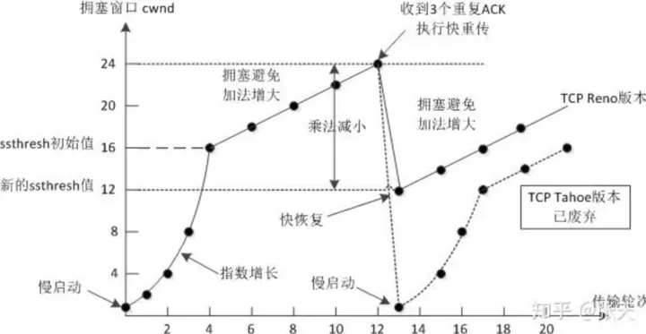

一.进程崩溃

​        在网络通讯时可能会出现进程突然崩溃的情况，当进程崩溃后进程就没了，就会导致进程的进程控制块（PCB）也被摧毁，而进程控制块中的一个属性”文件描述符表“也就被释放了，文件描述符表中有Socket网卡文件，将Socket网卡文件释放后相当于调用Socket.close(),于是崩溃的这一方就发出FIN（结束报文段）请求断开连接，就进一步触发了四次挥手，此时连接就正常释放了，所以，进程崩溃的处理和进程正常退出的处理没有区别

二.主机关机(正常步骤的关机)

​        正常关机，就会先尝试摧毁所有的进程（强制终止进程），就和上面说的进程崩溃的处理方式一样，在触发四次挥手断开网络连接时，主机正在关机，所以可能四次挥手挥完了以后才关机，也有可能没有挥完就关机了

​        但是四次挥手有没有挥完是没有问题的，因为即使四次挥手没有挥完，要关机的这个A设备的每个进程都会发送一个FIN（结束报文段）给网络连接的另一方B设备，此时接收到FIN（结束报文段）的B设备就会返回一个ACK（应答报文段）并且发送一个FIN（结束报文段），但是A设备可能已经关机了，所以不会返回ACK（应答报文段）给B设备，B设备没有收到A设备返回的ACK（应答报文段）就会触发超时重传，再进行多次重传都没有得到A设备返回的ACK（应答报文段）后，B设备就会单方面的断开连接（释放存储网络连接相关信息的内存）

三.主机掉电（拔电源，没有任何反应的时间）

根据掉电的一方正在发送数据还是接收数据，分为两种情况

​        1.掉电的一方正在接收数据

​        假设设备A正在发送数据给设备B，此时设备B突然断电。

​        设备A发送数据过去以后，由于设备B已经断电，所以并不会接收到设备A发送的数据，也不会返回ACK（应答报文段）给 设备A，设备A在等待一段时间后仍然没有收到设备B返回的ACK（应答报文段）就会触发超时重传（关于超时重传推荐看出现丢包问题的情况以及解决方法），在多次重传以后还是没有接收到设备B返回的ACK（应答报文段）就会触发复位报文（RST），尝试重置连接，要是重置操作仍然失败，此时设备A就会单方面的断开连接（释放与设备B进行网络连接相关的内存数据）

​        2.掉电的一方正在发送数据

​        假设设备A正在发送数据给设备B，此时设备A突然断电。

​        设备B就处于了一个尴尬的状态，因为设备B正在接收数据，突然设备A就不发送数据了，设备B也不知道设备A是一会发送数据还是一直都不发送数据了，所以就会进入阻塞等待。

​        而这里就涉及到了一个”心跳包“的机制，设备B虽然是接收方，但也会周期性的发送一个不含任何业务数据(不含载荷)的TCP数据报给设备A,目的就是触发设备A返回ACK(应答报文段)给设备B，监测设备A是否正在正常工作，网络是否通畅

​        要是设备B发送TCP数据报给设备A以后，没有收到设备A返回的ACK(应答报文段)就说明此时与设备A之间的网络连接已经出现问题了，设备B就会单方面的断开与设备A之间的网络连接。

​        注意

​        虽然TCP中已经有心跳包的支持了，但是还不够，往往需要在应用层，应用程序中重新实现心跳包（TCP心跳包，周期太长了，是分钟级别的）而在现在高并发的场景下，分钟级是远远不够的，需要秒级甚至毫秒级的心跳包，可以在更短的时间内，发现某个服务器出现问题

四.网线断开

​        相当于主机断电的升级版本，假设在网线断开时，设备A正在给设备B发送数据

​        1,设备A作为发送端，设备A的处理方式就和主机掉电时”掉电的一方正在发送数据“的处理方式相同

​        2.设备B作为接收端，设备B的处理方式就和主机掉电时”掉电的一方正在接收数据“的处理方式相同

**TCP拥塞控制**

**拥塞控制**

拥塞的发生是因为路由器缓存溢出，拥塞会导致丢包，但丢包不一定触发拥塞。拥塞控制是快速传输的基础。一个拥塞控制算法一般包括慢启动算法、拥塞避免算法、快速重传算法、快速恢复算法四部分。

**5.1 慢启动算法**

不同拥塞算法慢启动的逻辑有所不同，经典的 NewReno 慢启动的算法如下：

连接建好的开始先初始化 cwnd = 10，表明可以传 10 个 MSS 大小的数据。

每当收到一个 ACK，cwnd 加 1。这样每当过了一个 RTT（网络往返时延），cwnd 翻倍，呈指数上升。

还有一个 ssthresh（slow start threshold），是一个上限。当 cwnd >=ssthresh 时，就会进入“拥塞避免算法”。

**5.2 拥塞避免算法**

当 cwnd 增长到 sshthresh 时，就会进入“拥塞避免算法”。拥塞避免算法下 cwnd 成线性增长，即每经过一个往返时间 RTT 就把发送方的拥塞窗口 cwnd 加 1，而不是加倍。这样就可以避免拥塞窗口快速增长的问题。

每收到一个 ack 时 cwnd 的变化： cwnd = cwnd + 1 / cwnd

**5.3 快速重传算法**

快速重传算法主要用于丢包检测，以便能更快重传数据包，更早的调整拥塞状态机状态，从而达到持续升窗的目的。 具体重传策略见第三节 重传机制。

**5.4 快速恢复算法**

当检测到丢包时，TCP 会触发快速重传并进入降窗状态。该状态下 cwnd 会通过快速恢复算法降至一个合理值。

**5.5 记分板算法**

记分板算法是为了统计网络中正在传输的包数量，即tcp_packets_in_flight。只有当 cwnd > tcp_packets_in_flight 时，TCP 才允许发送重传包或者新数据包到网络中。tcp_packets_in_flight和packets_out, sacked_out, retrans_out, lost_out有关。其中packets_out表示发出去的包数量，sacked_out为sack的包数量，retrans_out为重传的包数量，lost_out为loss的包数量，这里的loss包含rto,FR和RACK等机制判断出来的丢失包。

tcp_packets_in_fligℎ�=packets_out−sacked_out+lost_out+retrans_out

为了可以正确统计这些数据，内核给每个 tcp 包(tcp_skb_cb)添加了sacked字段标记该数据包当前的状态。

__u8 sacked; /* State flags for SACK. */ #define TCPCB_SACKED_ACKED 0x01 /* SKB ACK'd by a SACK block */ #define TCPCB_SACKED_RETRANS 0x02 /* SKB retransmitted */ #define TCPCB_LOST 0x04 /* SKB is lost */ #define TCPCB_TAGBITS 0x07 /* All tag bits */ #define TCPCB_REPAIRED 0x10 /* SKB repaired (no skb_mstamp_ns) */ #define TCPCB_EVER_RETRANS 0x80 /* Ever retransmitted frame */ #define TCPCB_RETRANS (TCPCB_SACKED_RETRANS|TCPCB_EVER_RETRANS| \ TCPCB_REPAIRED)

需要在意的有TCPCB_SACKED_ACKED（被 SACK 块 ACK'd）,TCPCB_SACKED_RETRANS(重传),TCPCB_LOST（丢包），其状态转换图如下：

记分板状态转换逻辑如下：

首先判定丢包，打L tag，lost_out++，即 L

如果需要重传，打Rtag，retrans_out++，即 L|R

如果再次丢包，取消Rtag，retrans_out–，lost_out 维持不变，go to step2，此时标记位为 L

当 SACKED 时，取消L|R，retrans_out–，lost_out–，此时为 S

当 snd_una 向右更新时，packet_out–

**5.6 拥塞窗口校验**

在 [RFC2861] 中，区分了 TCP 连接数据传输的三种状态：

network-limited：TCP 的数据传输受限于拥塞窗口而不能发送更多的数据。

application-limited：TCP 的数据传输速率受限于应用层的数据写入速率，并没有到达拥塞窗口上限。

idle：发送端没有额外的数据等待发送，当数据发送间隔超过一个 RTO 的时候就认为是 ilde 态。

cwnd 代表了对网络拥塞状态的一个评估，拥塞控制要根据 ACK 来更新 cwnd 的前提条件是，当前的数据发送速率真实的反映了 cwnd 的状况，也就是说当前传输状态是 network-limited。假如 tcp 隔了很长时间没有发送数据包，即进入 idle，那么当前真实的网络拥塞状态很可能就会与 cwnd 反映的网络状况有差距。另外在 application-limited 的场景下，受限数据的 ACK 报文还可能把 cwnd 增长到一个异常大的值，显然是不合理的。基于上面提到的两个问题，[RFC2861]引入了拥塞窗口校验(CWV，Congestion Window Validation)算法。

算法如下：当需要发送新数据时，首先看距离上次发送操作是否超过一个 RTO，如果超过，则 1. 更新 sshthresh 值，设为 max(ssthresh, (3/4) * cwnd)。 2.每经过一个空闲 RTT 时间，cwnd 值减半，但不小于 1 SMSS。

对于应用受限阶段（非空闲阶段），执行相似的操作： 1. 已使用的窗口大小记为 �used。 2. 更新 ssthresh 值，设为 max(ssthresh, (3/4) * cwnd)。

cwnd 设为 cwnd 和 �used 的平均值。

上述操作均减小了 cwnd，但 ssthresh 维护了 cwnd 的先前值。避免空闲阶段可能发生的大数据量注入，可以减轻对有限的路由缓存的压力，从而减少丢包情况的产生。注意 CWV 减小了 cwnd 值，但没有减小 ssthresh，因此采用这种算法的通常结果是，在长时间发送暂停后，发送方会进入慢启动阶段。Linux TCP 实现了 CWV 算法并默认启用。

