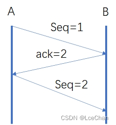
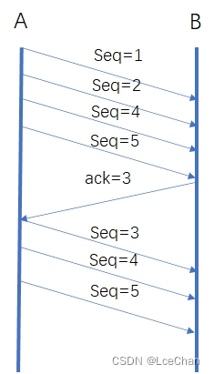
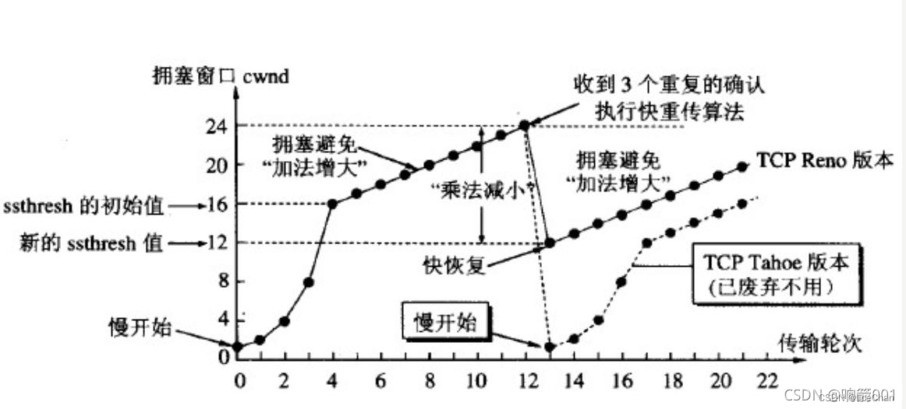
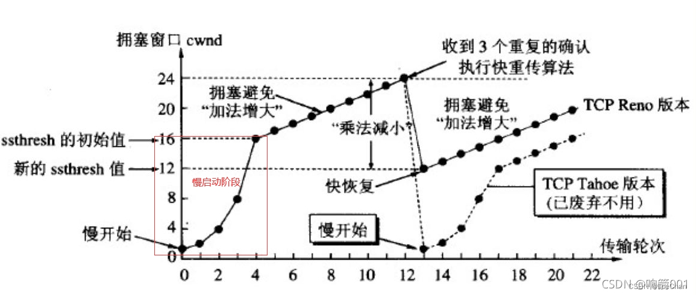
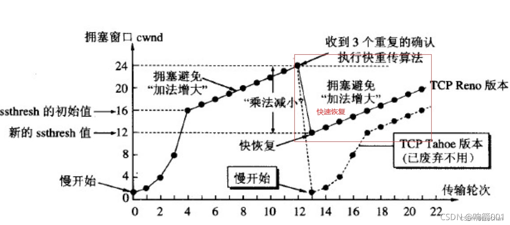

一般而言对于大部分的应用使用TCP既可以满足工程的需求，因为TCP即保证的可靠性，又是一个相对绅士的协议，对于网络拥塞提供了流量和拥塞控制保证了网络友好性。那为啥还需要使用UDP呢？主要是因为在一些实时性要求比较高的情景中TCP没办法满足要求同时对于数据量不大的低功耗情景也是考虑使用的UDP，但是需要在用户态自行保证可靠性，也就是接下来需要阐述的内容。

**1 可靠性传输** 

**1.1 重传机制**

**1.1.1 重传的三种策略**

**1. 停等协议** 这是一种比较古老的方式，效率比较低，主要是每发送**一帧数据**后需要接收到对方的回复之后才发送下一帧数据，主要是用于对话的模式，一问一答。

**2. 回退N帧重传** 这种方式目前TCP仍然有在使用，就是发送一串**连续的包**，当中间存在丢包的情况后，会回复确认连续收到包的**最大值**，对应丢包以后的数据包都需要重传。

**3. 选择性重传**从上面回退N帧的方式发现比较浪费带宽，因此想到一一个方式，就是我们只重传对方丢失的包。可以正向告诉发送端，哪一个报文丢失，重传丢失报文即可。

**1.2 流量控制**

**1. 流量控制的目的** 主要是是为了保证网络带宽的通畅，防止带宽浪费，而引入的机制，主要是在发送方进行流量的控制，即控制发送方的**发送速率**。 

**2. 流量控制原理** 利用发送端和接收端的窗口进行调节当前的流量。边界条件，当**接收端窗口**为0时，发送方需要终止发送。即没有可以接收的空间，需要终止发送。 3. 终止发送后，什么时候恢复发送速率？ （1）接收端读数据时，需要更新窗口给发送方。 （2）隔一段时间发一个探测包去询问。接收方需要回应窗口大小。

**1.3 拥塞控制** 

这里介绍两种策略，这幅图估计大部分人都不陌生。

1.3.1 慢启动

慢启动：其实并不慢主要是起点低，从一个包开始发送，然后指数递增。

1.3.2 快速恢复：快速恢复并不快采用的是线性递增的方式，主要是起点高从阈值的一半开始。

**1.4 基本概念**

RTO：定时器超时时间，即超时后需要进行数据包重传。

注意：tcp超时计算：第一次重传时间：RTO2，连续丢包三次之后变成：RTO8，延迟非常大。

RTT：网络往返时延，需要记录发送方和接收方的时间戳。